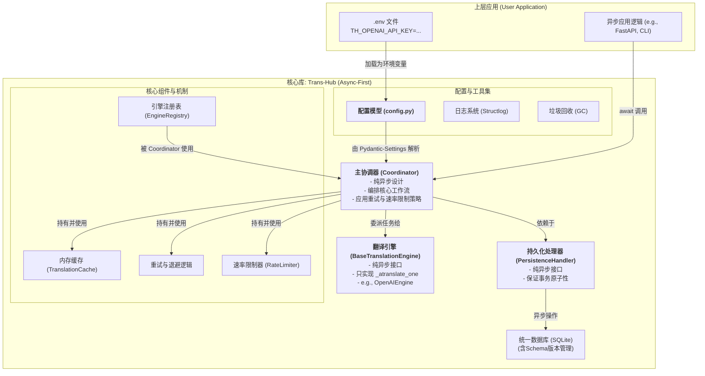

# **架构概述：Trans-Hub v2.0**

**本文档的目标读者**: 核心维护者、社区贡献者，以及希望深入理解 `Trans-Hub` 内部工作原理的用户。

**文档目的**: 本文档旨在提供一个关于 `Trans-Hub` 系统架构、设计原则和核心工作流程的高层概览。它是理解“系统如何工作”的起点。

---

## **1. 设计哲学与核心原则**

### **1.1 项目定位**

`Trans-Hub` 是一个**异步优先**、可嵌入 Python 应用程序的、带持久化存储的智能本地化（i18n）后端引擎。它旨在统一和简化多语言翻译工作流，通过智能缓存、可插拔的翻译引擎、以及健壮的错误处理和策略控制，为上层应用提供高效、低成本、高可靠的翻译能力。

### **1.2 核心工程原则**

- **异步优先 (Async-First)**: 整个核心库被设计为纯异步，以实现最大的 I/O 并发性能，并与现代异步 Web 框架（如 FastAPI）无缝集成。
- **契约优先 (Contract First)**: 所有模块交互都通过严格的 DTOs (使用 Pydantic) 和接口 (`typing.Protocol`) 进行约束。
- **结构化配置 (Structured Configuration)**: 系统的所有配置项均通过 Pydantic 模型进行定义和验证，并能自动从环境变量或 `.env` 文件加载。
- **依赖注入 (Dependency Injection)**: 核心组件在其构造函数中接收其依赖，使得组件之间松耦合，易于测试和替换。
- **生命周期感知 (Lifecycle-Aware)**: 系统设计包含了数据的演进（通过独立的迁移脚本）和清理（通过垃圾回收功能）。
- **职责明确 (Clear Separation of Concerns)**: 各组件职责高度内聚。`PersistenceHandler` 只管理数据库，`Engine` 只处理翻译逻辑，`Coordinator` 只负责编排工作流。

---

## **2. 系统架构**

`Trans-Hub` 采用模块化的分层架构，确保各组件职责单一、易于测试和替换。



---

## **3. 插件化翻译引擎设计**

### **3.1 插件发现机制**

`Trans-Hub` 采用一种轻量级的“懒加载”自动发现机制。`engine_registry.py` 模块在首次被导入时，会自动扫描 `trans_hub.engines` 包。如果某个引擎模块因缺少可选依赖（如 `openai` 库）而导入失败，它会捕获 `ModuleNotFoundError` 并优雅地跳过，而不会使整个应用崩溃。

### **3.2 `BaseTranslationEngine` 核心模式**

所有翻译引擎必须继承的**纯异步**抽象基类，它定义了引擎的核心契约，并内置了批处理逻辑。

- **泛型设计**: `BaseTranslationEngine` 是一个泛型类 (`BaseTranslationEngine[ConfigType]`)，允许 Mypy 在编译时进行精确的类型检查。
- **核心抽象方法**: **`async def _atranslate_one(...)`**。这是所有引擎**唯一必须实现**的翻译方法。它只负责处理**单个文本**的翻译逻辑。
- **内置批处理**: 引擎开发者**无需**关心批处理和并发。`BaseTranslationEngine` 的 `atranslate_batch` 公共方法会自动接收文本列表，并使用 `asyncio.gather` 来并发调用开发者实现的 `_atranslate_one` 方法。
- **适配同步库**: 如果一个引擎底层依赖的是一个同步库（例如 `translators`），它应该在其 `_atranslate_one` 方法内部使用 **`asyncio.to_thread`** 来包装阻塞调用，以确保不阻塞事件循环。

> _关于如何开发一个新引擎的详细指南，请参见 [贡献文档](../contributing/developing_engines.md)_

---

## **4. 核心工作流详解**

以下是 `Coordinator.process_pending_translations` 的核心工作流，它整合了内存缓存、数据库交互和引擎调用。

```mermaid
sequenceDiagram
    participant App as 上层应用
    participant Coord as Coordinator
    participant Cache as TranslationCache
    participant Handler as PersistenceHandler
    participant Engine as TranslationEngine

    App->>+Coord: process_pending_translations('zh-CN')
    Coord->>+Handler: stream_translatable_items('zh-CN', ...)
    Note over Handler: 事务1: 锁定一批待办任务<br>(状态->TRANSLATING)
    Handler-->>-Coord: yield batch_of_items

    loop 针对每个翻译批次
        Coord->>+Cache: _separate_cached_items(batch)
        Cache-->>-Coord: cached_results, uncached_items

        opt 如果有未缓存的项目 (uncached_items)
            loop 批次内部的重试尝试
                Note over Coord: (应用速率限制)
                Coord->>+Engine: atranslate_batch(uncached_items)
                Note over Engine: (并发调用 _atranslate_one)
                Engine-->>-Coord: List<EngineBatchItemResult>

                alt 批次中存在可重试错误
                    Coord->>Coord: await asyncio.sleep(指数退避)
                else
                    break
                end
            end
            Coord->>+Cache: _cache_new_results(new_success_results)
            Cache-->>-Coord: (新结果已缓存)
        end

        Note over Coord: 组合所有结果 (缓存+新翻译)
        Coord->>+Handler: save_translations(all_results)
        Note over Handler: 事务2: 原子更新翻译记录
        Handler-->>-Coord: (数据库更新完成)

        loop 对每个最终结果
            Coord-->>App: yield TranslationResult
        end
    end
```

---

## **5. 错误处理、重试与速率限制**

- **错误分类**: `EngineError` 的 **`is_retryable`** 属性是错误分类的核心。API 返回的 `5xx` (服务器错误) 或 `429` (请求过多) 通常被视为可重试，而 `4xx` (客户端错误) 则不可重试。
- **重试策略**: `Coordinator` 内建了一个带**指数退避 (Exponential Backoff)** 的重试循环。
- **速率限制**: 在**每次**尝试调用引擎 API 之前（包括重试），`Coordinator` 都会调用 `rate_limiter.acquire()`。

---

## **6. 日志记录与可观测性**

- **库**: 使用 `structlog` 实现结构化日志。
- **格式**: 开发环境使用彩色的控制台格式，生产环境推荐切换为 `json` 格式，便于日志聚合系统（如 ELK, Splunk）的采集和分析。
- **调用链 ID (Correlation ID)**: 支持使用 `structlog.contextvars` 绑定 `correlation_id`，使得可以轻松地从海量日志中筛选出与单次请求相关的所有日志记录。
