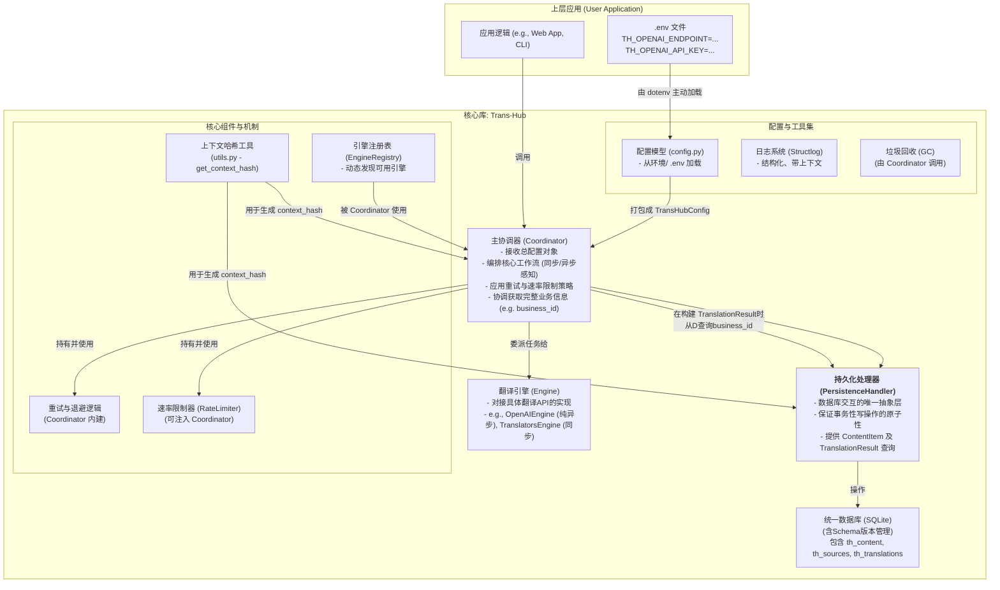
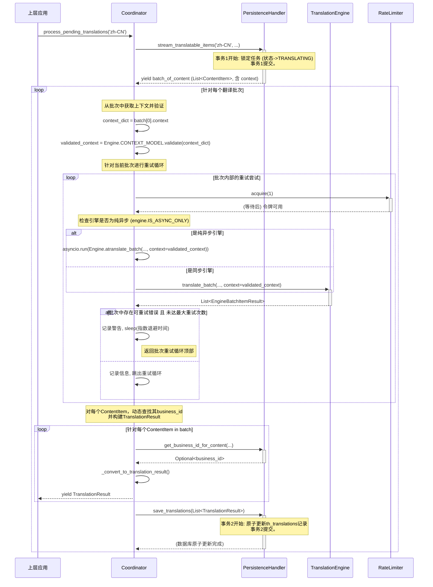

# **架构概述：`Trans-Hub` 核心引擎**

**本文档的目标读者**: 核心维护者、社区贡献者，以及希望深入理解 `Trans-Hub` 内部工作原理的用户。

**文档目的**: 本文档旨在提供一个关于 `Trans-Hub` 系统架构、设计原则和核心工作流程的高层概览。它是理解“系统如何工作”的起点。

---

## **1. 项目概述与核心原则**

### **1.1 项目定位**

`Trans-Hub` 是一个可嵌入 Python 应用程序的、带持久化存储的智能本地化（i18n）后端引擎。它旨在统一和简化多语言翻译工作流，通过智能缓存、可插拔的翻译引擎、以及健壮的错误处理和策略控制，为上层应用提供高效、低成本、高可靠的翻译能力。

### **1.2 核心工程原则**

- **契约优先 (Contract First)**: 所有外部输入和内部模块交互都通过严格的 DTOs (数据传输对象，使用 Pydantic 定义) 和 `typing.Protocol` 定义的接口进行约束，确保类型安全和数据一致性。
- **结构化配置 (Structured Configuration)**: 系统的所有配置项（如数据库路径、API 密钥）均通过结构化的 Pydantic 模型（包括`pydantic_settings.BaseSettings`）进行定义和验证。配置加载遵循 **环境优先** 的原则，并支持使用 `.env` 文件进行本地开发。
- **依赖注入 (Dependency Injection)**: 核心组件（如 `Coordinator`）在其构造函数中接收其依赖（如 `PersistenceHandler`），使得组件之间松耦合，易于测试和替换。
- **生命周期感知 (Lifecycle-Aware)**: 系统设计包含了数据的演进（通过独立的迁移脚本）和清理（通过垃圾回收功能），确保长期运行的健康性。
- **职责明确 (Clear Separation of Concerns)**: 各组件职责高度内聚。`PersistenceHandler` 只管理数据库交互，`Engine` 只处理具体翻译 API 的逻辑，`Coordinator` 只负责编排整个工作流并协调不同数据源以提供完整的业务视图（例如 `business_id`）。

---

## **2. 系统架构与配置注入**

### **2.1 系统架构**

`Trans-Hub` 采用模块化的分层架构，确保各组件职责单一、易于测试和替换。

### **2.2 配置加载与注入模式**

1.  **主动加载**: 强烈建议上层应用在启动时，首先调用 `dotenv.load_dotenv()`，将 `.env` 文件中的配置显式加载到环境变量中。这是最健壮、最能抵抗环境干扰的方式。
2.  **模型解析**: 各引擎的配置模型（如 `OpenAIEngineConfig`）需**同时继承** `pydantic_settings.BaseSettings` (以便从环境变量加载) 和 `trans_hub.engines.base.BaseEngineConfig` (以便与引擎基类 `BaseTranslationEngine` 的泛型约束兼容)。`pydantic-settings` 会自动从环境变量中解析和验证配置。最终所有引擎配置被聚合到一个 `TransHubConfig` 对象中。
3.  **依赖注入**: 上层应用负责创建 `PersistenceHandler` 和 `TransHubConfig` 的实例，并将它们作为参数注入到 `Coordinator` 的构造函数中。`Coordinator` 内部负责根据 `TransHubConfig` 中的配置**动态创建**所需的引擎实例，使用引擎自身的 `CONFIG_MODEL` 进行验证和实例化。

---

## **3. 插件化翻译引擎设计**

### **3.1 插件发现机制 (懒加载自动发现)**

`Trans-Hub` 采用一种轻量级的“懒加载”自动发现机制。

- **实现**: `engine_registry.py` 模块在首次被导入时，会自动扫描 `trans_hub.engines` 包下的所有模块。
- **工作方式**: 它会尝试导入每个模块。如果导入成功，则解析模块中的引擎类并注册。如果导入失败（通常因为缺少可选依赖，如 `openai` 库），它会捕获 `ModuleNotFoundError`，记录一条警告并优雅地跳过，而不会使整个应用崩溃。
- **优点**: 保持了 `Trans-Hub` 核心库的轻量级。用户只需安装他们真正需要的引擎依赖，系统就能自动适应环境中已安装的库。

### **3.2 `BaseTranslationEngine` 接口**

所有翻译引擎必须继承的抽象基类，定义了引擎的核心契约。为了提高类型安全性，`BaseTranslationEngine` 被设计为**泛型类** (`BaseTranslationEngine[ConfigType]`)。

- **泛型设计**: 通过使用 `typing.TypeVar` 和 `typing.Generic`，`BaseTranslationEngine` 能够指定其 `CONFIG_MODEL` 和 `__init__` 方法接受的配置对象类型是 `BaseEngineConfig` 的**任意子类**。这允许 Mypy 在编译时精确地检查具体引擎（如 `OpenAIEngine`）对 `self.config` 特定属性的访问。
- **核心属性**: 包含 `CONFIG_MODEL`, `CONTEXT_MODEL`, `VERSION`, `REQUIRES_SOURCE_LANG`, 以及新增的 **`IS_ASYNC_ONLY`** 标志。
  - **`IS_ASYNC_ONLY` (bool)**: 一个布尔标志，默认为 `False`。如果一个引擎（如 `OpenAIEngine`）被设计为纯异步，它应将此标志设置为 `True`。`Coordinator` 会检查此标志，并相应地决定是调用同步的 `translate_batch` 方法，还是通过 `asyncio.run()` 调用异步的 `atranslate_batch` 方法。
- **核心抽象方法**: `translate_batch` (同步批量翻译) 和 `atranslate_batch` (异步批量翻译)。所有具体引擎必须实现这两个方法，并确保返回的列表长度和顺序与输入文本列表严格一一对应。

*（关于如何开发一个新引擎的详细指南，请参见 [贡献文档](../contributing/developing_engines.md)）*

---

## **4. 核心工作流详解**

以下是 `Coordinator.process_pending_translations` 的详细工作流：

---

## **5. 错误处理、重试与速率限制**

- **错误分类**: `EngineError` 的 **`is_retryable`** 属性是错误分类的核心。API 返回的 `5xx` (服务器错误) 或 `429` (Too Many Requests) 状态码通常被视为可重试，而 `4xx` (如 `401 Unauthorized`, `400 Bad Request`) 则被视为不可重试。
- **重试策略**: `Coordinator` 内建了一个带**指数退避 (Exponential Backoff)** 的重试循环。每次失败后，等待时间会翻倍 (`initial_backoff * (2 ** attempt)`)，以避免在短时间内频繁冲击过载的服务器。
- **速率限制**: 在**每次**尝试调用引擎 API 之前（包括重试），`Coordinator` 都会调用 `rate_limiter.acquire()`，确保即使在重试风暴中，API 调用速率也始终处于受控状态。

---

## **6. 日志记录与可观测性**

- **库**: 使用 `structlog` 实现结构化日志，`python-dotenv` 辅助配置加载。
- **基础**: `structlog` 建立在 Python **标准 `logging` 模块**之上。`logging_config.py` 负责配置标准 `logging`，并桥接 `structlog` 的处理器，确保所有通过 `logging.info()` 或 `structlog.get_logger(__name__).info()` 发出的日志都被统一处理。
- **格式**: 开发环境使用彩色的控制台格式，生产环境推荐切换为 `json` 格式，便于日志聚合系统（如 ELK, Splunk）的采集和分析。
- **调用链 ID (Correlation ID)**: 支持使用 `structlog.contextvars` 绑定 `correlation_id`。这使得可以轻松地从海量日志中筛选出与单次请求相关的所有日志记录，是微服务和复杂系统调试的利器。
