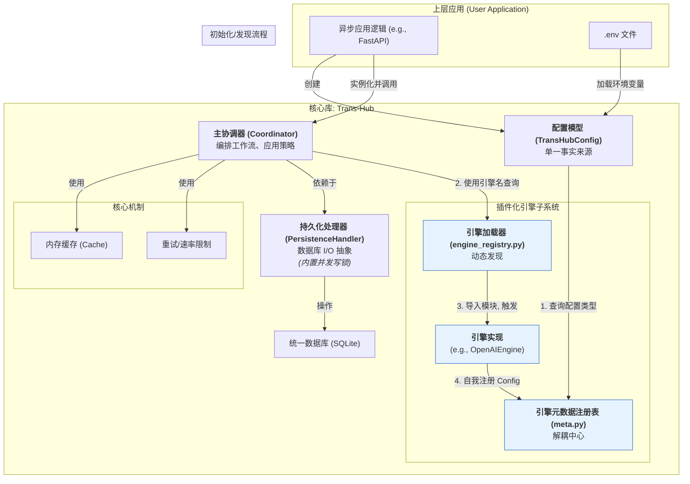

# **架构概述：Trans-Hub v2.2**

**本文档的目标读者**: 核心维护者、社区贡献者，以及希望深入理解 `Trans-Hub` 内部工作原理的用户。

**文档目的**: 本文档旨在提供一个关于 `Trans-Hub` 系统架构、设计原则和核心工作流程的高层概览。它是理解“系统如何工作”的起点。

[返回文档索引](../INDEX.md)

---

## **1. 设计哲学与核心原则**

### **1.1 项目定位**

`Trans-Hub` 是一个**异步优先**、可嵌入 Python 应用程序的、带持久化存储的智能本地化（i18n）后端引擎。它旨在统一和简化多语言翻译工作流，通过智能缓存、可插拔的翻译引擎、以及健壮的错误处理和策略控制，为上层应用提供高效、低成本、高可靠的翻译能力。

### **1.2 核心工程原则**

- **异步优先 (Async-First)**: 整个核心库被设计为纯异步，以实现最大的 I/O 并发性能，并与现代异步 Web 框架（如 FastAPI）无缝集成。
- **职责明确 (Clear Separation of Concerns)**: 各组件职责高度内聚。`PersistenceHandler` 只管理数据库，`Engine` 只处理翻译逻辑，`Coordinator` 只负责编排工作流。
- **依赖注入 (Dependency Injection)**: 核心组件在其构造函数中接收其依赖，使得组件之间松耦合，易于测试和替换。
- **契约优先 (Contract First)**: 所有模块交互都通过严格的 DTOs (使用 Pydantic) 和接口 (`typing.Protocol`) 进行约束。
- **结构化配置 (Structured Configuration)**: 系统的所有配置项均通过 Pydantic 模型进行定义和验证，并能自动从环境变量或 `.env` 文件加载。

---

## **2. 系统架构**

`Trans-Hub` 采用模块化的分层架构和**依赖倒置**的注册模式，确保各组件职责单一、高度解耦。



### **组件职责**

- **`Coordinator` (主协调器)**: **业务流程的大脑**。它是上层应用与之交互的唯一入口。它负责编排所有操作：接收请求、应用重试/速率限制策略、调用引擎、处理缓存和将结果存入数据库。
- **`PersistenceHandler` (持久化处理器)**: **数据库的守门人**。它是一个定义了所有数据库读写操作的抽象接口。其默认实现 `DefaultPersistenceHandler` 基于 `aiosqlite`，并通过**内部的异步写锁**来保证所有写操作的事务安全，即使在多个并发的 Worker 和 API 请求下也能稳定工作。
- **`BaseTranslationEngine` (引擎基类)**: **翻译能力的插件插槽**。它定义了所有翻译引擎必须遵守的契约，其核心是实现 `_atranslate_one` 异步方法。
- **`TransHubConfig` (配置模型)**: **系统的控制面板**。它是一个 Pydantic 模型，集中了所有的配置项，并由 `Coordinator` 在初始化时动态填充。
- **引擎发现与注册机制**:
  - `engine_registry.py` 负责**发现和加载**引擎的**实现代码** (`...Engine` 类)。
  - `engines/meta.py` 负责维护一个引擎名到其**配置模型** (`...Config` 类) 的映射。
  - 这个双注册表系统彻底解耦了配置系统和引擎实现，避免了循环依赖。

---

## **3. 核心工作流详解**

以下是 `Coordinator.process_pending_translations` 的核心工作流，它整合了内存缓存、数据库交互和引擎调用。

```mermaid
sequenceDiagram
    participant App as 上层应用
    participant Coord as Coordinator
    participant Cache as TranslationCache
    participant Handler as PersistenceHandler
    participant Engine as TranslationEngine

    App->>+Coord: process_pending_translations('zh-CN')
    Coord->>+Handler: stream_translatable_items('zh-CN', ...)
    Note over Handler: (获取写锁)<br>事务1: 锁定一批待办任务<br>(状态->TRANSLATING)<br>(释放写锁)
    Handler-->>-Coord: yield batch_of_items

    loop 针对每个翻译批次 (按 context 分组)
        Coord->>+Cache: 检查内存缓存
        Cache-->>-Coord: cached_results, uncached_items

        opt 如果有未缓存的项目
            loop 批次内部的重试尝试
                Note over Coord: (应用速率限制)
                Coord->>+Engine: atranslate_batch(uncached_items)
                Engine-->>-Coord: List<EngineBatchItemResult>
                alt 批次中存在可重试错误
                    Coord->>Coord: await asyncio.sleep(指数退避)
                else
                    break
                end
            end
            Coord->>+Cache: 缓存新翻译结果
            Cache-->>-Coord: (新结果已缓存)
        end

        Note over Coord: 组合所有结果
        Coord->>+Handler: save_translations(all_results)
        Note over Handler: (获取写锁)<br>事务2: 原子更新翻译记录<br>(释放写锁)
        Handler-->>-Coord: (数据库更新完成)

        loop 对每个最终结果
            Coord-->>App: yield TranslationResult
        end
    end
```

### **并发安全**

`Trans-Hub` 被设计用于高并发环境。为了处理像“多个生产者 (`request`) 和一个工作者 (`process_pending_translations`) 同时对数据库进行写操作”这样的场景，`DefaultPersistenceHandler` 在其内部实现了一个**异步写锁 (`asyncio.Lock`)**。

- 所有执行**写事务**的方法（如 `ensure_pending_translations`, `save_translations`）在执行前都必须获取这个锁。
- 这确保了对数据库的写操作是**原子且串行**的，从根本上避免了事务冲突和数据竞争。
- **只读**操作（如 `get_translation`）**不会**获取这个锁，因此可以与正在进行的写操作并发执行（得益于 SQLite 的 WAL 模式），最大限度地保证了读取性能。

---

## **4. 扩展性**

`Trans-Hub` 的设计使其在两个关键维度上具有高度的可扩展性：

1.  **翻译能力**: 通过在 `trans_hub/engines/` 目录下添加新文件，可以轻松地集成任何第三方翻译服务。
    > _详见 [指南：开发一个新引擎](../contributing/developing_engines.md)_
2.  **存储后端**: 通过实现 `PersistenceHandler` 协议，可以将默认的 SQLite 存储替换为任何支持异步的数据库，如 PostgreSQL (使用 `asyncpg`) 或 MySQL。

这使得 `Trans-Hub` 能够灵活地适应从小型项目到大规模、高并发生产环境的各种需求。