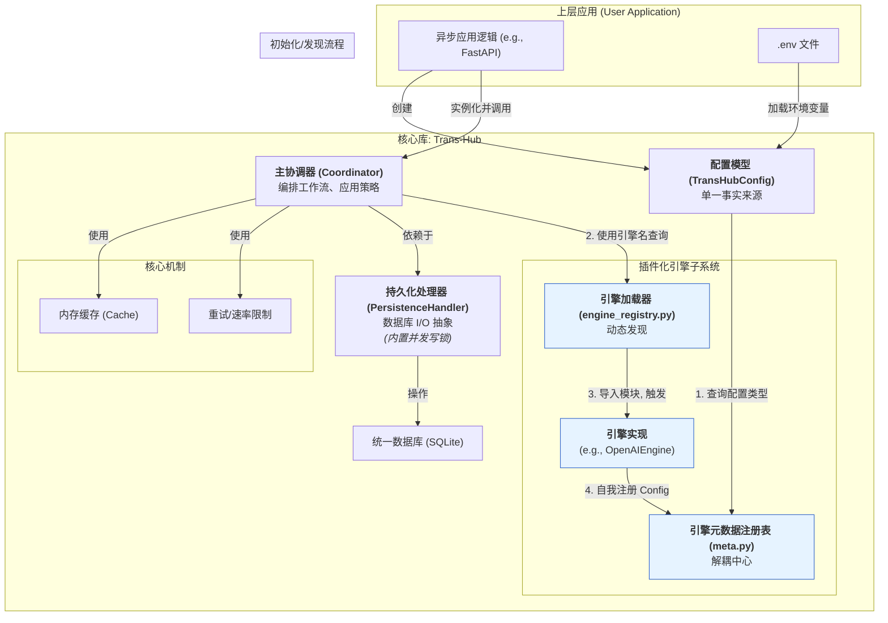

# **Architecture Overview: Trans-Hub v2.2**

The target audience of this document: core maintainers, community contributors, and users who wish to gain a deeper understanding of the internal workings of `Trans-Hub`.

**Document Purpose**: This document aims to provide a high-level overview of the `Trans-Hub` system architecture, design principles, and core workflows. It serves as a starting point for understanding "how the system works.

[Return to Document Index](../INDEX.md)

## **1. Design Philosophy and Core Principles**

### **1.1 Project Positioning**

Trans-Hub is an **asynchronous-first**, embeddable Python application with persistent storage, serving as an intelligent localization (i18n) backend engine. It aims to unify and simplify multilingual translation workflows, providing efficient, low-cost, and highly reliable translation capabilities for upper-layer applications through intelligent caching, pluggable translation engines, and robust error handling and policy control.

### **1.2 Core Engineering Principles**

- **Async-First**: The entire core library is designed to be purely asynchronous to achieve maximum I/O concurrency performance and seamlessly integrate with modern asynchronous web frameworks like FastAPI.
- **Clear Separation of Concerns**: Each component has a highly cohesive responsibility. `PersistenceHandler` only manages the database, `Engine` only handles translation logic, and `Coordinator` is solely responsible for orchestrating workflows.
- **Dependency Injection**: Core components receive their dependencies in their constructors, allowing for loose coupling between components, making them easy to test and replace.
- **Contract First**: All module interactions are constrained by strict DTOs (using Pydantic) and interfaces (`typing.Protocol`).
- **Structured Configuration**: All configuration items of the system are defined and validated through Pydantic models and can be automatically loaded from environment variables or `.env` files.

## **2. System Architecture**

Trans-Hub" adopts a modular layered architecture and a **dependency inversion** registration model, ensuring that each component has a single responsibility and is highly decoupled.



### **Component Responsibilities**

- **`Coordinator`**: **The brain of the business process**. It is the only entry point for upper-level applications to interact with it. It is responsible for orchestrating all operations: receiving requests, applying retry/rate limiting strategies, calling the engine, handling caching, and storing results in the database.
- **`PersistenceHandler`**: **The gatekeeper of the database**. It is an abstract interface that defines all database read and write operations. Its default implementation, `DefaultPersistenceHandler`, is based on `aiosqlite` and ensures the transactional safety of all write operations through an **internal asynchronous write lock**, allowing it to work stably even under multiple concurrent Workers and API requests.
- **`BaseTranslationEngine`**: **The plugin slot for translation capabilities**. It defines the contract that all translation engines must adhere to, with the core being the implementation of the `_atranslate_one` asynchronous method.
- **`TransHubConfig`**: **The control panel of the system**. It is a Pydantic model that centralizes all configuration items and is dynamically populated by the `Coordinator` during initialization.
- **Engine discovery and registration mechanism**:
  - `engine_registry.py` is responsible for **discovering and loading** the **implementation code** of the engines (`...Engine` classes).
  - `engines/meta.py` is responsible for maintaining a mapping from engine names to their **configuration models** (`...Config` classes).
  - This dual registry system completely decouples the configuration system from the engine implementation, avoiding circular dependencies.

## **3. Detailed Explanation of Core Workflow**

The following is the core workflow of `Coordinator.process_pending_translations`, which integrates memory caching, database interaction, and engine calls.

```mermaid
sequenceDiagram
    participant App as 上层应用
    participant Coord as Coordinator
    participant Cache as TranslationCache
    participant Handler as PersistenceHandler
    participant Engine as TranslationEngine

    App->>+Coord: process_pending_translations('zh-CN')
    Coord->>+Handler: stream_translatable_items('zh-CN', ...)
    Note over Handler: (获取写锁)<br>事务1: 锁定一批待办任务<br>(状态->TRANSLATING)<br>(释放写锁)
    Handler-->>-Coord: yield batch_of_items

    loop 针对每个翻译批次 (按 context 分组)
        Coord->>+Cache: 检查内存缓存
        Cache-->>-Coord: cached_results, uncached_items

        opt 如果有未缓存的项目
            loop 批次内部的重试尝试
                Note over Coord: (应用速率限制)
                Coord->>+Engine: atranslate_batch(uncached_items)
                Engine-->>-Coord: List<EngineBatchItemResult>
                alt 批次中存在可重试错误
                    Coord->>Coord: await asyncio.sleep(指数退避)
                else
                    break
                end
            end
            Coord->>+Cache: 缓存新翻译结果
            Cache-->>-Coord: (新结果已缓存)
        end

        Note over Coord: 组合所有结果
        Coord->>+Handler: save_translations(all_results)
        Note over Handler: (获取写锁)<br>事务2: 原子更新翻译记录<br>(释放写锁)
        Handler-->>-Coord: (数据库更新完成)

        loop 对每个最终结果
            Coord-->>App: yield TranslationResult
        end
    end
```

### **Concurrency Safety**

Trans-Hub" is designed for high-concurrency environments. To handle scenarios such as "multiple producers (`request`) and one worker (`process_pending_translations`) simultaneously writing to the database," the `DefaultPersistenceHandler` internally implements an **asynchronous write lock (`asyncio.Lock`)**.

- All methods that execute **write transactions** (such as `ensure_pending_translations`, `save_translations`) must acquire this lock before execution.
- This ensures that write operations to the database are **atomic and serial**, fundamentally avoiding transaction conflicts and data races.
- **Read-only** operations (such as `get_translation`) **do not** acquire this lock, allowing them to be executed concurrently with ongoing write operations (thanks to SQLite's WAL mode), maximizing read performance.

## **4. Scalability**

The design of `Trans-Hub` provides high scalability in two key dimensions:

1.  **Translation Capability**: By adding new files in the `trans_hub/engines/` directory, you can easily integrate any third-party translation service.
    > _See [Guide: Developing a New Engine](../contributing/developing_engines.md)_
2.  **Storage Backend**: By implementing the `PersistenceHandler` protocol, you can replace the default SQLite storage with any asynchronous database, such as PostgreSQL (using `asyncpg`) or MySQL.

This enables `Trans-Hub` to flexibly adapt to various needs, from small projects to large-scale, high-concurrency production environments.
