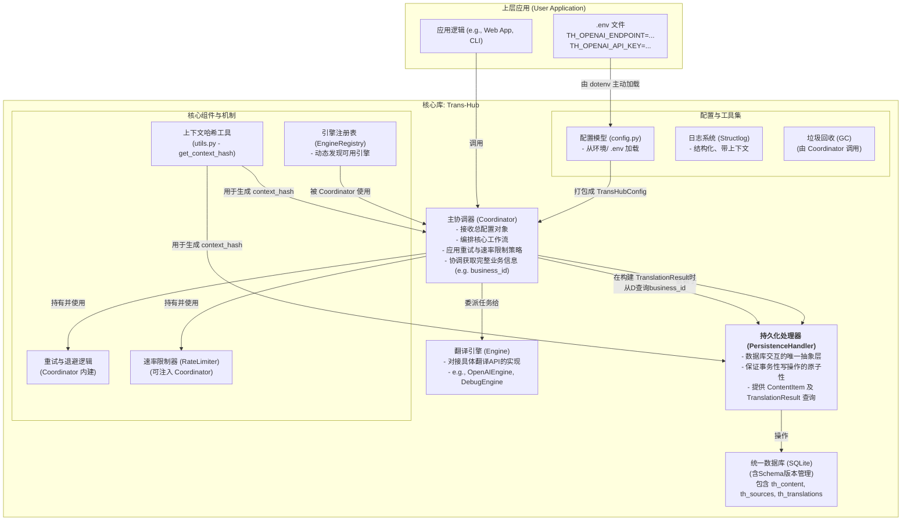
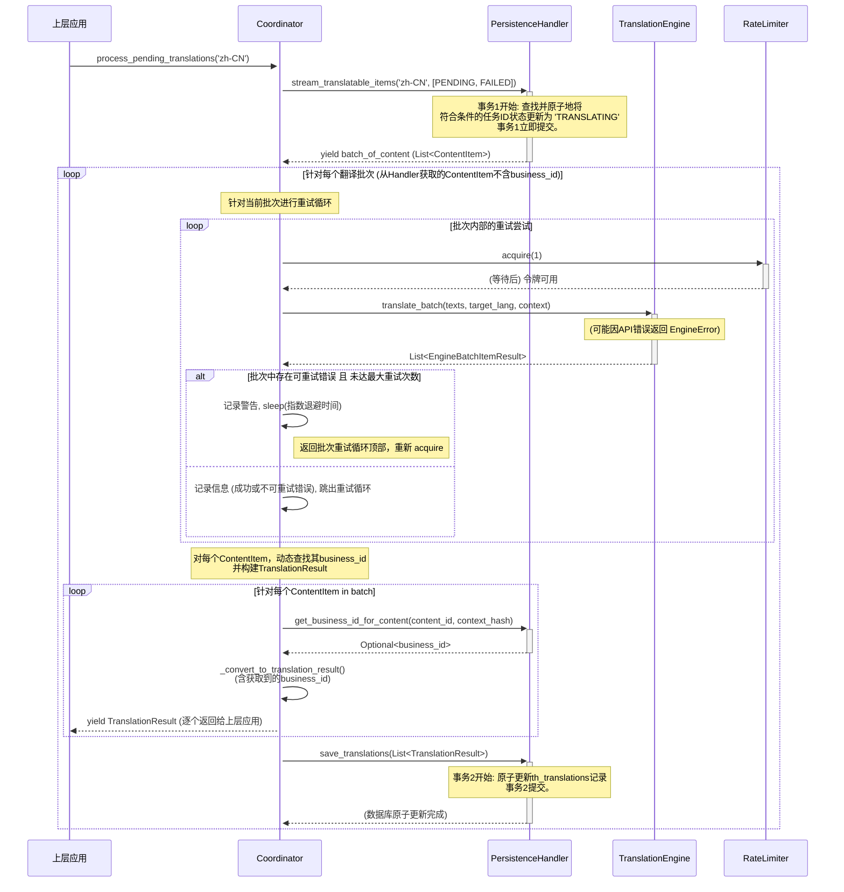

# **项目技术规范文档：`Trans-Hub` 核心引擎**

**版本**: 1.1.0 (重大更新)
**文档状态**: **最终发布版 (Final Release - 修正并优化)**
**目标读者**: 项目核心开发团队、未来维护者、社区贡献者
**文档目的**: 本文档是 `Trans-Hub` 项目 v1.1 的权威技术规范与最终实现记录，是所有开发与维护工作的“单一事实来源”(Single Source of Truth)。它详尽地描述了从架构设计、数据模型、核心实现到部署配置的全部细节，旨在确保项目的长期可维护性、可扩展性与高质量。

---

## **目录**

1.  [项目概述与核心原则](#1-项目概述与核心原则)
2.  [系统架构与配置注入](#2-系统架构与配置注入)
3.  [数据模型与数据库设计 (最终版)](#3-数据模型与数据库设计-最终版)
4.  [插件化翻译引擎设计](#4-插件化翻译引擎设计)
5.  [核心模块与类设计](#5-核心模块与类设计)
6.  [核心工作流详解](#6-核心工作流详解)
7.  [错误处理、重试与速率限制](#7-错误处理重试与速率限制)
8.  [日志记录与可观测性](#8-日志记录与可观测性)
9.  [附录 A：配置指南 (`.env`)](#附录a配置指南-env)
10. [附录 B：术语表](#附录b-术语表)
11. [附录 C：第三方引擎开发指南](#附录c-第三方引擎开发指南)
12. [附录 D：`business_id` 命名指南与最佳实践](#附录d-business_id-命名指南与最佳实践)

---

## **1. 项目概述与核心原则**

### **1.1 项目定位**

`Trans-Hub` 是一个可嵌入 Python 应用程序的、带持久化存储的智能本地化（i18n）后端引擎。它旨在统一和简化多语言翻译工作流，通过智能缓存、可插拔的翻译引擎、以及健壮的错误处理和策略控制，为上层应用提供高效、低成本、高可靠的翻译能力。

### **1.2 核心工程原则**

- **契约优先 (Contract First)**: 所有外部输入和内部模块交互都通过严格的 DTOs (数据传输对象，使用 Pydantic 定义) 和 `typing.Protocol` 定义的接口进行约束，确保类型安全和数据一致性。
- **结构化配置 (Structured Configuration)**: 系统的所有配置项（如数据库路径、API 密钥）均通过结构化的 Pydantic 模型（包括**`pydantic_settings.BaseSettings`**）进行定义和验证。配置加载遵循 **环境优先** 的原则，并支持使用 `.env` 文件进行本地开发。
- **依赖注入 (Dependency Injection)**: 核心组件（如 `Coordinator`）在其构造函数中接收其依赖（如 `PersistenceHandler`），使得组件之间松耦合，易于测试和替换。
- **生命周期感知 (Lifecycle-Aware)**: 系统设计包含了数据的演进（通过独立的迁移脚本）和清理（通过**垃圾回收**功能），确保长期运行的健康性。
- **职责明确 (Clear Separation of Concerns)**: 各组件职责高度内聚。`PersistenceHandler` 只管理数据库交互，`Engine` 只处理具体翻译 API 的逻辑，`Coordinator` 只负责编排整个工作流并**协调不同数据源以提供完整的业务视图**（例如 `business_id`）。

---

## **2. 系统架构与配置注入**

### **2.1 系统架构**

`Trans-Hub` 采用模块化的分层架构，确保各组件职责单一、易于测试和替换。



### **2.2 配置加载与注入模式 (最终方案)**

1.  **主动加载**: 强烈建议上层应用在启动时，首先调用 `dotenv.load_dotenv()`，将 `.env` 文件中的配置显式加载到环境变量中。这是最健壮、最能抵抗环境干扰的方式。
2.  **模型解析**: 各引擎的配置模型（如 `OpenAIEngineConfig`）需**同时继承** `pydantic_settings.BaseSettings` (以便从环境变量加载) 和 `trans_hub.engines.base.BaseEngineConfig` (以便与引擎基类 `BaseTranslationEngine` 的泛型约束兼容)。`pydantic-settings` 会自动从环境变量中解析和验证配置。最终所有引擎配置被聚合到一个 `TransHubConfig` 对象中。
3.  **依赖注入**: 上层应用负责创建 `PersistenceHandler` 和 `TransHubConfig` 的实例，并将它们作为参数注入到 `Coordinator` 的构造函数中。`Coordinator` 内部负责根据 `TransHubConfig` 中的配置**动态创建**所需的引擎实例，使用引擎自身的 `CONFIG_MODEL` 进行验证和实例化。

---

## **3. 数据模型与数据库设计 (最终版)**

### **3.1 数据库支持与要求**

- **默认实现**: SQLite。为保证并发性能，**必须以 WAL 模式运行**。
- **原子性要求**: `PersistenceHandler` 的所有写操作**必须是事务性原子操作**，通过 `transaction()` 上下文管理器提供。
- **数据库迁移**: 迁移通过独立的 `schema_manager.py` 和 SQL 文件进行管理，应作为显式的部署步骤执行，而不是在程序运行时自动执行。

### **3.2 数据库 Schema (v1.1)**

#### `th_content` (内容表)

- **职责**: 存储所有唯一的、去重后的文本字符串，作为所有翻译的源头。
- `id` (INTEGER PRIMARY KEY)
- `value` (TEXT, UNIQUE): 文本内容本身。
- `created_at` (TIMESTAMP): 记录创建时间。

#### `th_sources` (来源表)

- **职责**: 建立业务逻辑中的标识符 (`business_id`) 与具体内容 (`content_id`) 和上下文 (`context_hash`) 之间的权威关联。**`business_id` 的唯一和最新活跃时间戳在此表维护。**
- `business_id` (TEXT, PRIMARY KEY): 上层应用定义的唯一业务标识符。
- `content_id` (INTEGER, FK to `th_content.id`): 关联的内容 ID。
- `context_hash` (TEXT, NOT NULL, DEFAULT '**GLOBAL**'): 关联的上下文哈希。**不再允许 `NULL` 值，`__GLOBAL__` 哨兵值用于表示无特定上下文，以确保 `UNIQUE` 约束的正确性。**
- `last_seen_at` (TIMESTAMP): 用于**垃圾回收**的时间戳，每次 `request` 关联此 `business_id` 时更新。
- **索引**: `(last_seen_at)`, `(content_id)`。

#### `th_translations` (译文表)

- **职责**: 存储一个内容针对特定语言和上下文的翻译结果及其元数据。
- `id` (INTEGER PRIMARY KEY)
- `content_id` (INTEGER, FK to `th_content.id`, ON DELETE CASCADE): 关联的内容 ID。
- `source_lang_code` (TEXT, NULLABLE): 源语言，`NULL` 表示由引擎自动检测。
- `lang_code` (TEXT): 目标语言。
- `context_hash` (TEXT, NOT NULL, DEFAULT '**GLOBAL**'): 上下文哈希。**不再允许 `NULL` 值，`__GLOBAL__` 哨兵值用于表示全局翻译。**
- `translation_content` (TEXT): 翻译后的文本。
- `engine` (TEXT): 执行翻译的引擎名称。
- `engine_version` (TEXT, NOT NULL): 引擎的版本号。
- `score` (REAL, NULLABLE): 翻译质量得分。
- **`business_id` 列已被移除**: `business_id` 不再直接存储在此表中。其获取职责已移至 `Coordinator` 层，通过 `PersistenceHandler` 协调查询 `th_sources` 实现。
- `status` (TEXT): `PENDING`, `TRANSLATING`, `TRANSLATED`, `FAILED`, `APPROVED`。
- `retry_count` (INTEGER): 重试次数。
- `last_updated_at` (TIMESTAMP): 记录的最后更新时间。
- **约束**: `UNIQUE(content_id, lang_code, context_hash)` 保证了翻译的唯一性。**由于 `context_hash` 始终非 `NULL`，此 `UNIQUE` 约束现在可以可靠地防止重复记录。**
- **索引**: `(status, last_updated_at)`, `(content_id)`。

### **3.3 垃圾回收 (GC)**

`Coordinator.run_garbage_collection()` 方法执行以下两步清理：

1.  **清理过期的业务关联**: 删除 `th_sources` 表中 `last_seen_at` **日期**早于保留期限的记录。
    - **核心实现**: 此操作通过在 SQL 查询中使用 `DATE()` 函数 (`WHERE DATE(last_seen_at) < ?`) 来实现。这意味着比较的是年-月-日，而不是精确的时间戳。
    - **行为影响**: 当 `retention_days=0` 时，此逻辑会清理所有 `last_seen_at` 在**今天之前**的记录，而保留所有“今天”的记录，无论其具体时间。这使得 GC 的行为在单次运行的脚本中也变得完全可预测和健壮。
    - 此操作支持 `dry_run` 模式，允许在不实际删除数据的情况下查看清理报告。
2.  **清理孤立的内容**: 删除 `th_content` 中**不再被任何 `th_sources` 或 `th_translations` 记录引用**的“孤立”记录。这是一个级联效应，第一步的操作可能会产生新的孤立内容。

**重要提示**：`GC` 仅清理 `th_sources` 中过期的**业务关联**。如果 `th_translations` 中存在某个文本的翻译结果，但其关联的 `business_id` 在 `th_sources` 中被清理，则该翻译结果本身（在 `th_translations`）仍会保留，除非其 `content_id` 变得完全孤立。

---

## **4. 插件化翻译引擎设计**

### **4.1 插件发现机制 (懒加载自动发现)**

v1.1 采用一种轻量级的“懒加载”自动发现机制。

- **实现**: `engine_registry.py` 模块在首次被导入时，会自动扫描 `trans_hub.engines` 包下的所有模块。
- **工作方式**: 它会尝试导入每个模块。如果导入成功，则解析模块中的引擎类并注册。如果导入失败（通常因为缺少可选依赖，如 `openai` 库），它会捕获 `ModuleNotFoundError`，记录一条警告并优雅地跳过，而不会使整个应用崩溃。
- **优点**: 保持了 `Trans-Hub` 核心库的轻量级。用户只需安装他们真正需要的引擎依赖，系统就能自动适应环境中已安装的库。

### **4.2 `BaseTranslationEngine` 接口**

所有翻译引擎必须继承的抽象基类，定义了引擎的核心契约。为了提高类型安全性，`BaseTranslationEngine` 被设计为**泛型类** (`BaseTranslationEngine[ConfigType]`)。

- **泛型设计**: 通过使用 `typing.TypeVar` 和 `typing.Generic`，`BaseTranslationEngine` 能够指定其 `CONFIG_MODEL` 和 `__init__` 方法接受的配置对象类型是 `BaseEngineConfig` 的**任意子类**。这允许 Mypy 在编译时精确地检查具体引擎（如 `OpenAIEngine`）对 `self.config` 特定属性的访问，解决了之前的类型检查问题。
- **核心属性**: 包含 `CONFIG_MODEL` (指定该引擎使用的具体配置模型类型), `CONTEXT_MODEL`, `VERSION`, `REQUIRES_SOURCE_LANG` 等。
- **核心抽象方法**: `translate_batch` (同步批量翻译) 和 `atranslate_batch` (异步批量翻译)。所有具体引擎必须实现这两个方法，并确保返回的列表长度和顺序与输入文本列表严格一一对应。

---

## **5. 核心模块与类设计**

### **5.1 `types.py` (v1.1 最终版)**

定义了所有核心 DTOs，是系统内部数据流的“血液”。关键 DTOs 及其变化：

- **`TranslationStatus`**: 枚举，未变。
- **`EngineBatchItemResult`** (`EngineSuccess` 和 `EngineError`): 未变。
- **`TranslationResult`**:
  - `context_hash` 字段类型从 `Optional[str]` 变为 `str` (不再允许 `NULL` 值)。
  - `business_id` 字段保留 `Optional[str]` 类型，但其值现在通过 `Coordinator` 在生成时动态从 `PersistenceHandler.get_business_id_for_content` 获取。
- **`SourceUpdateResult`**: 未变。
- **`ContentItem`**:
  - `context_hash` 字段类型从 `Optional[str]` 变为 `str` (不再允许 `NULL` 值)。
  - **`business_id` 字段已移除**：`ContentItem` 仅代表待翻译的内容本身，不直接携带业务标识。`business_id` 的关联职责已转移到 `Coordinator` 从 `PersistenceHandler` 动态获取。
- **`GLOBAL_CONTEXT_SENTINEL` (新增常量)**: 定义为 `__GLOBAL__`，用于表示无上下文的 `context_hash` 值，以避免 SQLite `UNIQUE` 约束中 `NULL` 值的特殊行为。

### **5.2 `config.py`**

定义了项目所有结构化的配置模型，包括 `TransHubConfig`, `EngineConfigs`, 以及各个具体引擎的配置模型。未变。

### **5.3 `PersistenceHandler` (`persistence.py`) (v1.1 修正版)**

数据库交互的接口及其同步实现 `DefaultPersistenceHandler`。

- 封装了所有 SQL 查询，并使用**事务性写操作**保证数据一致性。
- **`transaction()` 方法**：提供了一个上下文管理器，用于原子性地执行数据库操作。
- **`stream_translatable_items()` 方法 (核心变更)**：
  - 其内部事务已**拆分**：先在一个事务内锁定（更新状态为 `TRANSLATING`）并获取待处理任务的 ID 列表，此事务立即提交。
  - 随后，在事务外部，分批次地获取这些任务的详细内容（`ContentItem`），并通过生成器 `yield` 给调用者。这解决了事务嵌套问题，提高了并发性和资源释放效率。
  - 不再从 `th_translations` 表中选择 `business_id`，因为 `th_translations` 表已移除此字段。
- **`get_translation()` 方法 (新增)**：用于直接从 `th_translations` 缓存中获取已翻译的记录。它会调用 `get_business_id_for_content` 来填充 `TranslationResult` 中的 `business_id`。
- **`get_business_id_for_content()` 方法 (新增)**：一个内部辅助方法，根据 `content_id` 和 `context_hash` 从 `th_sources` 表中查找并返回对应的 `business_id`。
- **`sqlite3.Cursor` 修正**：所有直接使用 `self.connection.cursor()` 获取游标的地方，已移除 `with` 语句包裹，因为 `sqlite3.Cursor` 对象不支持上下文管理协议。
- `garbage_collect()` 方法现在支持 `dry_run` 参数，可在不执行实际删除的情况下报告清理计划。

### **5.4 `Coordinator` (`coordinator.py`) (v1.1 修正版)**

项目的“大脑”，通过依赖注入持有 `PersistenceHandler` 和 `TransHubConfig`。

- **`__init__()`**: 在构造时，会查询 `engine_registry`，并根据 `TransHubConfig` 中的配置动态地创建所需的活动引擎实例。此过程严格遵循引擎的 `CONFIG_MODEL` 进行配置对象的验证和实例化。
- **`request()` API (核心变更)**:
  - 在方法入口处进行严格的参数校验。
  - 如果提供了 `business_id`，则会更新 `th_sources` 表中的 `last_seen_at`。
  - 在向 `th_translations` 表插入 `PENDING` 任务时，**不再向其 `business_id` 字段传值**（因为该字段已被移除）。
  - 会检查 `th_translations` 中是否存在相同 `(content_id, lang_code, context_hash)` 且为 `TRANSLATED` 状态的记录，如果存在则跳过插入新的 `PENDING` 任务。
- **`process_pending_translations()` API (核心变更)**:
  - 遍历 `stream_translatable_items` 返回的 `ContentItem` 批次。
  - 在将 `EngineBatchItemResult` 转换为 `TranslationResult` DTO 之前，会调用 `persistence_handler.get_business_id_for_content()` 来动态获取对应的 `business_id`。这样确保返回给上层应用的 `TranslationResult` 包含最新的业务关联信息。
  - 内置可配置的重试机制和速率限制器。
- **`run_garbage_collection()` API**: 调用 `PersistenceHandler` 的垃圾回收功能。

### **5.5 `RateLimiter` (`rate_limiter.py`)**

一个基于令牌桶算法的、线程安全的速率限制器，用于控制对外部 API 的请求频率。未变。

### **5.6 `engine_registry.py`**

实现了懒加载自动发现机制，是项目插件化架构的核心。未变。

### **5.7 `utils.py` (v1.1 修正版)**

- **`get_context_hash()` (核心变更)**:
  - 当传入的 `context` 为 `None` 或空字典时，**不再返回 `None`**。
  - 而是返回一个特殊定义的字符串常量 `GLOBAL_CONTEXT_SENTINEL` (`__GLOBAL__`)。
  - 此改变是为了确保数据库 `th_translations` 和 `th_sources` 表中的 `context_hash` 列始终为 `NOT NULL`，从而使 `UNIQUE(content_id, lang_code, context_hash)` 约束在无上下文的情况下也能正常工作。

---

## **6. 核心工作流详解**

以下是 `process_pending_translations` 的详细工作流：



---

## **7. 错误处理、重试与速率限制**

- **错误分类**: `EngineError` 的 **`is_retryable`** 属性是错误分类的核心。API 返回的 `5xx` (服务器错误) 或 `429` (Too Many Requests) 状态码通常被视为可重试，而 `4xx` (如 `401 Unauthorized`, `400 Bad Request`) 则被视为不可重试。
- **重试策略**: `Coordinator` 内建了一个带**指数退避 (Exponential Backoff)** 的重试循环。每次失败后，等待时间会翻倍 (`initial_backoff * (2 ** attempt)`)，以避免在短时间内频繁冲击过载的服务器。
- **速率限制**: 在**每次**尝试调用引擎 API 之前（包括重试），`Coordinator` 都会调用 `rate_limiter.acquire()`，确保即使在重试风暴中，API 调用速率也始终处于受控状态。

---

## **8. 日志记录与可观测性**

- **库**: 使用 `structlog` 实现结构化日志，`python-dotenv` 辅助配置加载。
- **基础**: `structlog` 建立在 Python **标准 `logging` 模块**之上。`logging_config.py` 负责配置标准 `logging`，并桥接 `structlog` 的处理器，确保所有通过 `logging.info()` 或 `structlog.get_logger(__name__).info()` 发出的日志都被统一处理。
- **格式**: 开发环境使用彩色的控制台格式，生产环境推荐切换为 `json` 格式，便于日志聚合系统（如 ELK, Splunk）的采集和分析。
- **调用链 ID (Correlation ID)**: 使用 `structlog.contextvars` 绑定 `correlation_id`。这使得可以轻松地从海量日志中筛选出与单次请求相关的所有日志记录，是微服务和复杂系统调试的利器。

---

## **附录 A：配置指南 (`.env`)**

项目配置应通过在项目根目录下创建 `.env` 文件来管理。强烈建议在程序入口处调用 `dotenv.load_dotenv()` 来主动加载。

**示例 `.env` 文件:**

```env
# Trans-Hub 配置文件
# 使用前缀以避免与其他应用的环境变量冲突。

# --- OpenAI 引擎配置 ---
TH_OPENAI_ENDPOINT="https://api.openai.com/v1"
TH_OPENAI_API_KEY="your-real-or-dummy-key"
TH_OPENAI_MODEL="gpt-3.5-turbo"

# --- 其他引擎配置 (示例) ---
# TH_TRANSLATORS_PROVIDER="google" # 例如，指定 translators 引擎使用 Google 翻译
```

---

## **附录 B：术语表**

- **内容 (Content)**: 在`th_content`表中存储的、去重后的、唯一的文本字符串，是翻译的源头。
- **业务 ID (business_id)**: 上层应用传入的、全局唯一的静态字符串，用于追踪一个业务位置与特定内容（Content）和上下文（Context）的稳定关联。**其主要用于 `th_sources` 表的持久化和垃圾回收。**
- **上下文哈希 (context_hash)**: 基于引擎特定上下文内容的 SHA256 哈希，用于细粒度缓存命中。**现在始终为非 `NULL` 值，`__GLOBAL__` 哨兵值用于表示无特定上下文。**
- **`__GLOBAL__` 哨兵值**: 一个特殊的字符串常量，用于在 `context_hash` 字段中表示“无上下文”或“全局上下文”，以确保数据库的 `UNIQUE` 约束在所有情况下都能正常工作。
- **DTO (Data Transfer Object)**: 数据传输对象，在本项目中指用 Pydantic 定义的、用于模块间数据交换的模型类。
- **处理器 (Processor)**: 在 `structlog` 中，一个可调用对象，用于在日志事件字典被最终渲染前对其进行修改或添加数据。
- **渲染器 (Renderer)**: 在 `structlog` 中，一个特殊的处理器，用于将最终的日志事件字典转换成可读的字符串格式（如 JSON 或控制台彩色文本）。
- **垃圾回收 (GC)**: 一种维护操作，用于定期清理数据库中过时或不再被引用的数据，主要针对 `th_sources` 表中的业务关联记录，以确保数据库的健康和效率。

---

## **附录 C：第三方引擎开发指南**

要为 `Trans-Hub` 开发一个新的翻译引擎，你需要遵循以下步骤：

1.  **在 `trans_hub/engines/` 目录下创建你的引擎文件**，例如 `your_engine.py`。
2.  **创建配置模型**，**同时继承** `pydantic_settings.BaseSettings` (用于环境变量加载) 和 `trans_hub.engines.base.BaseEngineConfig` (用于类型系统兼容性)。并使用 `pydantic.Field(validation_alias=...)` 来映射环境变量。

    ```python
    # your_engine.py
    from pydantic import Field
    # 核心：从 pydantic_settings 导入 BaseSettings
    from pydantic_settings import BaseSettings, SettingsConfigDict
    # 核心：从 trans_hub.engines.base 导入 BaseEngineConfig
    from trans_hub.engines.base import BaseEngineConfig

    # 核心：同时继承 BaseSettings 和 BaseEngineConfig
    class YourEngineConfig(BaseSettings, BaseEngineConfig):
        model_config = SettingsConfigDict(extra="ignore")
        api_key: str = Field(validation_alias='TH_YOURENGINE_API_KEY')
        # ... 其他引擎特定配置
    ```

3.  **创建引擎类**，继承自 `BaseTranslationEngine`，并**明确指定**你的配置模型作为其泛型参数。

    ```python
    # your_engine.py
    from typing import List, Optional, Dict, Any
    from trans_hub.engines.base import BaseContextModel, BaseTranslationEngine
    from trans_hub.types import EngineBatchItemResult, EngineError, EngineSuccess

    # (可选) 定义你的引擎专用的 Context 模型
    class YourContext(BaseContextModel):
        formality: str = "default"

    # 核心：指定泛型参数 YourEngineConfig
    class YourEngine(BaseTranslationEngine[YourEngineConfig]):
        CONFIG_MODEL = YourEngineConfig
        CONTEXT_MODEL = YourContext # 绑定上下文模型 (如果定义了)
        VERSION = "1.0.0"
        REQUIRES_SOURCE_LANG = False # 根据引擎特性设置

        def __init__(self, config: YourEngineConfig):
            super().__init__(config)
            # 现在可以安全地访问 config.api_key 等 YourEngineConfig 特有属性
            self.client = YourEngineSdkClient(api_key=config.api_key)

        def translate_batch(
            self,
            texts: List[str],
            target_lang: str,
            source_lang: Optional[str] = None,
            context: Optional[YourContext] = None, # <-- 注意这里 context 的类型是 YourContext 实例
        ) -> List[EngineBatchItemResult]:
            # ... 实现同步翻译逻辑 ...
            # Coordinator 会自动将上层应用传入的 context 字典转换为 YourContext 实例
            # 你可以安全地访问 context.formality
            formality_level = context.formality if context else "default"
            pass

        async def atranslate_batch(
            self,
            texts: List[str],
            target_lang: str,
            source_lang: Optional[str] = None,
            context: Optional[YourContext] = None, # <-- 注意这里 context 的类型是 YourContext 实例
        ) -> List[EngineBatchItemResult]:
            # ... 实现异步翻译逻辑 (推荐使用真正的异步客户端) ...
            pass
    ```

4.  **在 `config.py` 中注册你的配置模型**，以便 `TransHubConfig` 能够识别并加载它。

    ```python
    # trans_hub/config.py
    from typing import Optional
    from pydantic import BaseModel
    # 导入你的引擎配置模型
    from trans_hub.engines.your_engine import YourEngineConfig

    class EngineConfigs(BaseModel):
        # ... 其他引擎的配置 ...
        your_engine: Optional[YourEngineConfig] = None # 字段名必须是小写的引擎名，与 TH_ACTIVE_ENGINE 的值一致
    ```

5.  **完成！** `engine_registry` 会自动发现你的新引擎。用户只需安装你引擎所需的依赖（例如 `pip install your-engine-sdk`），然后在 `TransHubConfig` 中设置 `active_engine="your_engine"` 即可使用。

---

## **附录 D：`business_id` 命名指南与最佳实践**

`business_id` 是 `Trans-Hub` 设计中的一个核心概念。它是一个由上层应用定义的、全局唯一的字符串，其主要目的是**将一段具体的文本内容（Content）与它在业务逻辑中出现的“位置”或“来源”进行稳定地关联**。这对于追踪内容来源、实现精细化缓存以及提供业务上下文至关重要。

#### **D.1 设计哲学：为何使用单一字符串**

`Trans-Hub` 选择使用一个灵活的、单一的字符串 `business_id`，以提供极致的灵活性，避免过度设计，并保持 API 的简洁性。这种设计允许上层应用根据自身业务场景的复杂性，自由地定义和组合 `business_id` 的结构。

#### **D.2 `business_id` 与数据流**

- `business_id` **主要存储在 `th_sources` 表**，并与 `content_id` 及 `context_hash` 构成唯一组合。它在 `th_sources` 表中的 `last_seen_at` 字段用于 `GC`，表示该业务关联的活跃程度。
- `th_translations` 表**不再存储 `business_id`**，以避免数据冗余和逻辑混淆。
- `Coordinator` 在生成最终的 `TranslationResult` 时，会根据 `content_id` 和 `context_hash` **动态地从 `th_sources` 表查询对应的 `business_id`** 并填充到 `TranslationResult` 中。如果 `th_sources` 中没有匹配的记录（例如被 `GC` 清理了），则 `TranslationResult` 的 `business_id` 将为 `None`。

#### **D.3 推荐的命名约定**

我们推荐使用一种**带命名空间的、点分式的路径结构**：`domain.subdomain.component.key`。例如，`产品.详情页.名称`。
建议 `business_id` 只包含**小写字母、数字、下划线 `_` 和横杠 `-`**，以确保跨系统兼容性和易读性。

#### **D.4 典型翻译场景的命名示例**

- **UI 界面文本**: `ui.login_page.title`, `ui.settings.save_button`
- **配置文件**: `config.plugin_manifest.name`, `config.settings.appearance.theme`
- **字幕文件**: `subtitle.s01e01.srt.line.123` (适用于特定文件内的行或片段)
- **数据库内容**: `db.products.42.description` (关联到数据库表、记录 ID 和字段名)
- **即席翻译**: 调用 `request()` 时，将 `business_id` 参数设为 `None`。这表示这段文本没有特定的业务来源或上下文，仅为一次性翻译请求。**这种即席翻译的 `TranslationResult` 将始终显示 `business_id: None`。**

一个好的 `business_id` 命名规范将使您的本地化项目在规模扩大时依然能够保持清晰和易于管理。

---
