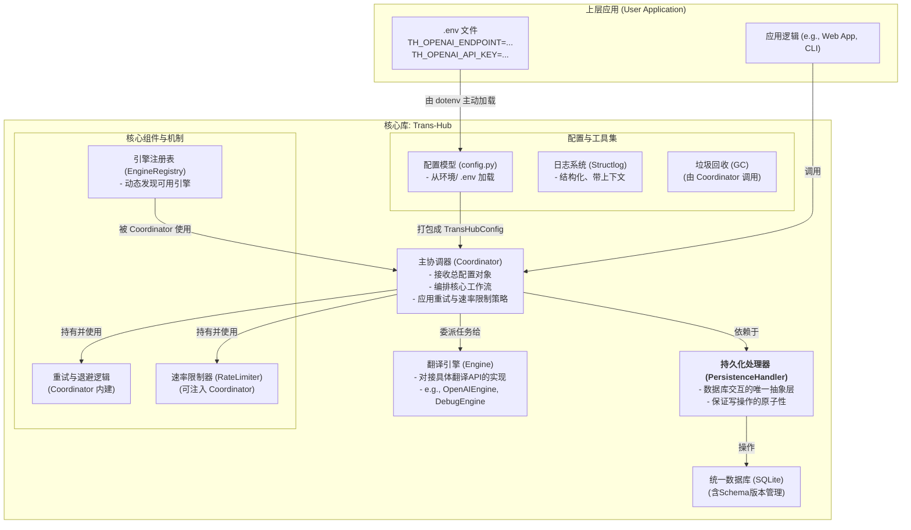
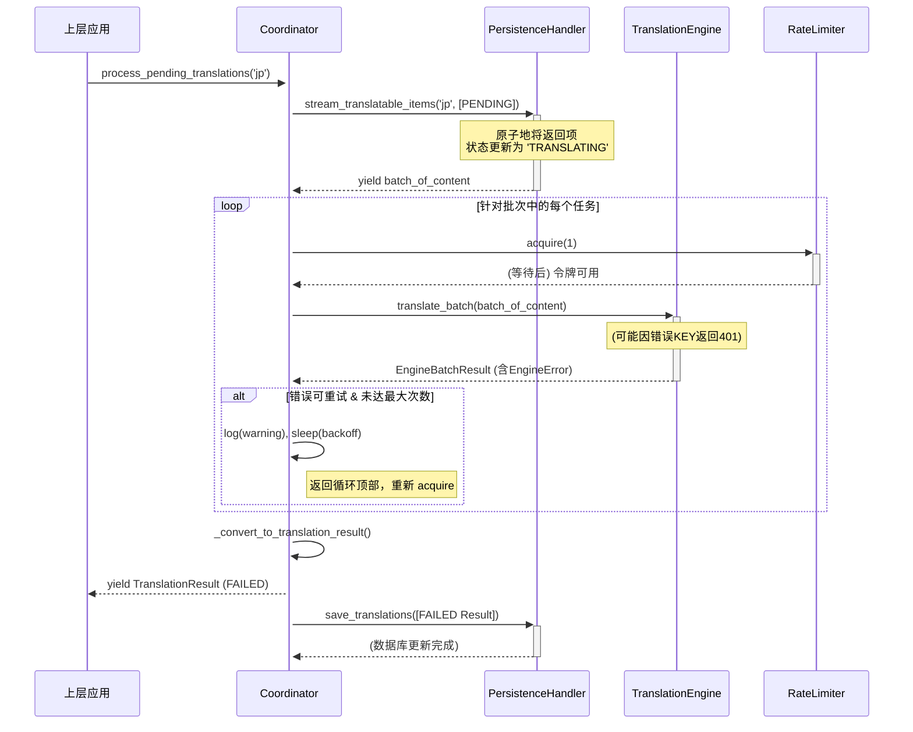

# **项目技术规范文档：`Trans-Hub` 核心引擎**

**版本**: 1.0.0
**文档状态**: **最终发布版 (Final, Released)**
**目标读者**: 项目核心开发团队, 未来维护者, 社区贡献者
**文档目的**: 本文档是 `Trans-Hub` 项目 v1.0 的权威技术规范与最终实现记录，是所有开发与维护工作的“单一事实来源”(Single Source of Truth)。它详尽地描述了从架构设计、数据模型、核心实现到部署配置的全部细节，旨在确保项目的长期可维护性、可扩展性与高质量。

---

## **目录**
1.  [项目概述与核心原则](#1-项目概述与核心原则)
2.  [系统架构与配置注入](#2-系统架构与配置注入)
3.  [数据模型与数据库设计 (最终版)](#3-数据模型与数据库设计-最终版)
4.  [插件化翻译引擎设计](#4-插件化翻译引擎设计)
5.  [核心模块与类设计](#5-核心模块与类设计)
6.  [核心工作流详解](#6-核心工作流详解)
7.  [错误处理、重试与速率限制](#7-错误处理重试与速率限制)
8.  [日志记录与可观测性](#8-日志记录与可观测性)
9.  [附录A：配置指南 (`.env`)](#附录a配置指南-env)
10. [附录B：术语表](#附录b术语表)
11. [附录C：第三方引擎开发指南](#附录c-第三方引擎开发指南)
12. [附录D：`business_id` 命名指南与最佳实践](#附录d-business_id-命名指南与最佳实践)

---

## **1. 项目概述与核心原则**

### **1.1 项目定位**

`Trans-Hub` 是一个可嵌入 Python 应用程序的、带持久化存储的智能本地化（i18n）后端引擎。它旨在统一和简化多语言翻译工作流，通过智能缓存、可插拔的翻译引擎、以及健壮的错误处理和策略控制，为上层应用提供高效、低成本、高可靠的翻译能力。

### **1.2 核心工程原则**

*   **契约优先 (Contract First)**: 所有外部输入和内部模块交互都通过严格的 DTOs (Data Transfer Objects, 使用 Pydantic 定义) 进行约束，确保类型安全和数据一致性。
*   **结构化配置 (Structured Configuration)**: 系统的所有配置项（如数据库路径、API密钥）均通过结构化的 Pydantic 模型进行定义和验证。配置加载遵循 **环境优先** 的原则，并支持使用 `.env` 文件进行本地开发。
*   **依赖注入 (Dependency Injection)**: 核心组件（如 `Coordinator`）在其构造函数中接收其依赖（如 `PersistenceHandler`），使得组件之间松耦合，易于测试和替换。
*   **生命周期感知 (Lifecycle-Aware)**: 系统设计包含了数据的演进（通过独立的迁移脚本）和清理（通过垃圾回收GC功能），确保长期运行的健康性。
*   **职责明确 (Clear Separation of Concerns)**: 各组件职责高度内聚。`PersistenceHandler` 只管数据库，`Engine` 只管翻译API，`Coordinator` 只管编排。

---

## **2. 系统架构与配置注入**

### **2.1 系统架构**

`Trans-Hub` 采用模块化的分层架构，确保各组件职责单一、易于测试和替换。



### **2.2 配置加载与注入模式 (最终方案)**
1.  **主动加载**: 强烈建议上层应用在启动时，首先调用 `dotenv.load_dotenv()`，将 `.env` 文件中的配置显式加载到环境变量中。这是最健壮、最能抵抗环境干扰的方式。
2.  **模型解析**: 各引擎的配置模型（如 `OpenAIEngineConfig`）继承自 `pydantic_settings.BaseSettings`，它会自动从环境变量中解析和验证配置。最终所有配置被聚合到一个 `TransHubConfig` 对象中。
3.  **依赖注入**: 上层应用负责创建 `PersistenceHandler` 和 `TransHubConfig` 的实例，并将它们作为参数注入到 `Coordinator` 的构造函数中。`Coordinator` 内部负责根据配置**动态创建**所需的引擎实例。

---

## **3. 数据模型与数据库设计 (最终版)**

### **3.1 数据库支持与要求**
*   **默认实现**: SQLite。为保证并发性能，**必须以WAL模式运行**。
*   **原子性要求**: `PersistenceHandler` 的所有写操作**必须是事务性的**。
*   **数据库迁移**: 迁移通过独立的 `schema_manager.py` 和 SQL 文件进行管理，应作为显式的部署步骤执行，而不是在程序运行时自动执行。

### **3.2 数据库 Schema (v1.0)**

#### `th_content` (内容表)
*   **职责**: 存储所有唯一的、去重后的文本字符串，作为所有翻译的源头。
*   `id` (INTEGER PRIMARY KEY)
*   `value` (TEXT, UNIQUE): 文本内容本身。
*   `created_at` (TIMESTAMP)

#### `th_sources` (来源表)
*   **职责**: 建立业务逻辑中的标识符 (`business_id`) 与具体内容 (`content_id`) 之间的关联。
*   `business_id` (TEXT, PRIMARY KEY): 上层应用定义的唯一业务标识符。
*   `content_id` (INTEGER, FK to `th_content.id`): 关联的内容ID。
*   `context_hash` (TEXT, NULLABLE): 关联的上下文哈希。
*   `last_seen_at` (TIMESTAMP): 用于垃圾回收的时间戳，每次 `request` 时更新。
*   **索引**: `(last_seen_at)`, `(content_id)`。

#### `th_translations` (译文表)
*   **职责**: 存储一个内容针对特定语言和上下文的翻译结果及其元数据。
*   `id` (INTEGER PRIMARY KEY)
*   `content_id` (INTEGER, FK to `th_content.id`, ON DELETE CASCADE): 关联的内容ID。
*   `source_lang_code` (TEXT, NULLABLE): 源语言，`NULL` 表示由引擎自动检测。
*   `lang_code` (TEXT): 目标语言。
*   `context_hash` (TEXT, NULLABLE): 上下文哈希，`NULL` 表示全局翻译。
*   `translation_content` (TEXT): 翻译后的文本。
*   `engine` (TEXT): 执行翻译的引擎名称。
*   `engine_version` (TEXT, NOT NULL): 引擎的版本号。
*   `score` (REAL, NULLABLE): 翻译质量得分。
*   `status` (TEXT): `PENDING`, `TRANSLATING`, `TRANSLATED`, `FAILED`, `APPROVED`。
*   `retry_count` (INTEGER): 重试次数。
*   `last_updated_at` (TIMESTAMP): 记录的最后更新时间。
*   **约束**: `UNIQUE(content_id, lang_code, context_hash)` 保证了翻译的唯一性。
*   **索引**: `(status, last_updated_at)`, `(content_id)`。

### **3.3 垃圾回收 (GC)**
`Coordinator.run_garbage_collection()` 方法执行以下两步清理：
1.  删除 `th_sources` 中 `last_seen_at` 早于保留期限的记录。
2.  删除 `th_content` 中**不再被任何 `th_sources` 或 `th_translations` 记录引用**的“孤立”记录。这是一个级联效应，第一步的操作可能会产生新的孤立内容。

---

## **4. 插件化翻译引擎设计**

### **4.1 插件发现机制 (懒加载自动发现)**
v1.0 采用一种轻量级的“懒加载”自动发现机制。
*   **实现**: `engine_registry.py` 模块在首次被导入时，会自动扫描 `trans_hub.engines` 包下的所有模块。
*   **工作方式**: 它会尝试导入每个模块。如果导入成功，则解析模块中的引擎类并注册。如果导入失败（通常因为缺少可选依赖，如 `openai` 库），它会捕获 `ModuleNotFoundError`，记录一条警告并优雅地跳过，而不会使整个应用崩溃。
*   **优点**: 保持了 `Trans-Hub` 核心库的轻量级。用户只需安装他们真正需要的引擎依赖，系统就能自动适应环境中已安装的库。

### **4.2 `BaseTranslationEngine` 接口**
所有翻译引擎必须继承的抽象基类，定义了引擎的核心契约。其设计与我们之前的讨论一致，包含 `CONFIG_MODEL`, `CONTEXT_MODEL`, `VERSION`, `REQUIRES_SOURCE_LANG` 等属性，以及 `translate_batch` 和 `atranslate_batch` 两个核心抽象方法。

---

## **5. 核心模块与类设计**

### **5.1 `types.py`**
定义了所有核心 DTOs，是系统的“血液”。关键 DTO 包括：`TranslationStatus`, `EngineError` (含 `is_retryable`), `TranslationResult`, `ContentItem`。

### **5.2 `config.py`**
定义了项目所有结构化的配置模型，包括 `TransHubConfig`, `EngineConfigs`, 以及各个具体引擎的配置模型（如 `OpenAIEngineConfig`）。这是进行配置管理的中心枢纽。

### **5.3 `PersistenceHandler` (`persistence.py`)**
数据库交互的接口及其同步实现 `DefaultPersistenceHandler`。封装了所有 SQL 查询，并使用事务保证数据一致性。

### **5.4 `Coordinator` (`coordinator.py`)**
项目的“大脑”，通过依赖注入持有 `PersistenceHandler` 和 `TransHubConfig`。
*   **`__init__()`**: 在构造时，会查询 `engine_registry`，并根据 `TransHubConfig` 中的配置动态地创建所需的活动引擎实例。
*   **API**: 提供了 `request()`, `process_pending_translations()`, 和 `run_garbage_collection()` 等核心公共方法。
*   **参数校验**: 在 `request` 和 `process_pending_translations` 等方法的入口处，对语言代码等关键参数进行格式校验，对无效输入会立即抛出 `ValueError`。

### **5.5 `RateLimiter` (`rate_limiter.py`)**
一个基于令牌桶算法的、线程安全的速率限制器。

### **5.6 `engine_registry.py`**
实现了上一节描述的懒加载自动发现机制，是项目插件化架构的核心。

---

## **6. 核心工作流详解**

以下是 `process_pending_translations` 的详细工作流：



---

## **7. 错误处理、重试与速率限制**

*   **错误分类**: `EngineError.is_retryable` 是错误分类的核心。API 返回的 `5xx` 或 `429` (Too Many Requests) 状态码通常被视为可重试，而 `4xx` (如 `401 Unauthorized`, `400 Bad Request`) 则被视为不可重试。
*   **重试策略**: `Coordinator` 内建了一个带**指数退避 (Exponential Backoff)** 的重试循环。每次失败后，等待时间会翻倍 (`initial_backoff * (2 ** attempt)`)，以避免在短时间内频繁冲击过载的服务器。
*   **速率限制**: 在**每次**尝试调用引擎 API 之前（包括重试），`Coordinator` 都会调用 `rate_limiter.acquire()`，确保即使在重试风暴中，API 调用速率也始终处于受控状态。

---

## **8. 日志记录与可观测性**

*   **库**: 使用 `structlog` 实现结构化日志，`python-dotenv` 辅助配置。
*   **格式**: 开发环境使用彩色的控制台格式，生产环境推荐切换为 `json` 格式，便于日志聚合系统（如 ELK, Splunk）的采集和分析。
*   **调用链ID**: 使用 `structlog.contextvars` 和 `uuid` 实现 `correlation_id` 的绑定和传递。这使得可以轻松地从海量日志中筛选出与单次请求相关的所有日志记录，是微服务和复杂系统调试的利器。

---

## **附录A：配置指南 (`.env`)**

项目配置应通过在项目根目录下创建 `.env` 文件来管理。建议在程序入口处调用 `dotenv.load_dotenv()` 来主动加载。

**示例 `.env` 文件:**
```env
# Trans-Hub 配置文件
# 使用前缀以避免与其他应用的环境变量冲突。

# --- OpenAI 引擎配置 ---
# [重要] 我们使用 ENDPOINT 而不是 BASE_URL 是为了避免我们遇到的解析问题。
TH_OPENAI_ENDPOINT="https://api.oneabc.org/v1"
TH_OPENAI_API_KEY="your-real-or-dummy-key"
TH_OPENAI_MODEL="gpt-3.5-turbo"
```

---

## **附录B：术语表**
*   **内容 (Content)**: 在`th_content`表中存储的、去重后的、唯一的文本字符串。
*   **业务ID (business_id)**: 上层应用传入的、全局唯一的静态字符串，用于追踪一个业务位置与特定内容（Content）的关联。
*   **上下文哈希 (context_hash)**: 基于引擎特定上下文内容的 SHA256 哈希，用于细粒度缓存命中。
*   **DTO (Data Transfer Object)**: 数据传输对象，在本项目中指用 Pydantic 定义的、用于模块间数据交换的模型类。

---

## **附录C：第三方引擎开发指南**

要为 `Trans-Hub` 开发一个新的翻译引擎，你需要遵循以下步骤：

1.  **在 `trans_hub/engines/` 目录下创建你的引擎文件**，例如 `your_engine.py`。
2.  **创建配置模型**，继承自 `BaseSettings`，并使用 `Field(validation_alias=...)` 来映射环境变量。
    ```python
    # your_engine.py
    from pydantic import Field
    from pydantic_settings import BaseSettings
    
    class YourEngineConfig(BaseSettings):
        api_key: str = Field(validation_alias='TH_YOURENGINE_API_KEY')
    ```
3.  **创建引擎类**，继承自 `BaseTranslationEngine`，并绑定你的配置模型。
    ```python
    # your_engine.py
    from trans_hub.engines.base import BaseTranslationEngine
    
    class YourEngine(BaseTranslationEngine):
        CONFIG_MODEL = YourEngineConfig
        VERSION = "1.0.0"
        # ... 实现 __init__ 和 translate_batch ...
    ```
4.  **在 `config.py` 中注册你的配置模型**，以便 `Coordinator` 能够识别它。
    ```python
    # trans_hub/config.py
    from trans_hub.engines.your_engine import YourEngineConfig
    
    class EngineConfigs(BaseModel):
        # ... 其他引擎 ...
        your_engine: Optional[YourEngineConfig] = None # 字段名必须是小写的引擎名
    ```
5.  **完成！** `engine_registry` 会自动发现你的新引擎。用户只需安装你引擎所需的依赖（例如 `pip install your-engine-sdk`），然后在 `TransHubConfig` 中设置 `active_engine="your_engine"` 即可使用。

---

## **附录D：`business_id` 命名指南与最佳实践**

`business_id` 是 `Trans-Hub` 设计中的一个核心概念。它是一个由上层应用定义的、全局唯一的字符串，其主要目的是**将一段具体的文本内容（Content）与它在业务逻辑中出现的“位置”或“来源”进行稳定地关联**。

#### **D.1 设计哲学：为何使用单一字符串**
`Trans-Hub` 选择使用一个灵活的、单一的字符串 `business_id`，以提供极致的灵活性，避免过度设计，并保持 API 的简洁性。

#### **D.2 推荐的命名约定**
我们推荐使用一种**带命名空间的、点分式的路径结构**：`domain.subdomain.component.key`。建议只使用**小写字母、数字、下划线 `_` 和横杠 `-`**。

#### **D.3 典型翻译场景的命名示例**

*   **UI界面文本**: `ui.login_page.title`, `ui.settings.save_button`
*   **配置文件**: `config.plugin_manifest.name`, `config.settings.appearance.theme`
*   **字幕文件**: `subtitle.s01e01.srt.line.123`
*   **数据库内容**: `db.products.42.description`
*   **即席翻译**: 调用 `request()` 时，将 `business_id` 参数设为 `None`。

一个好的 `business_id` 命名规范将使您的本地化项目在规模扩大时依然能够保持清晰和易于管理。