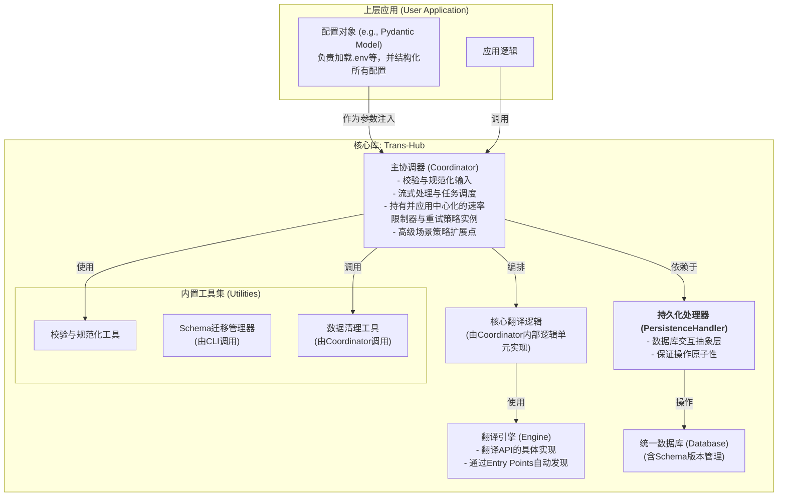
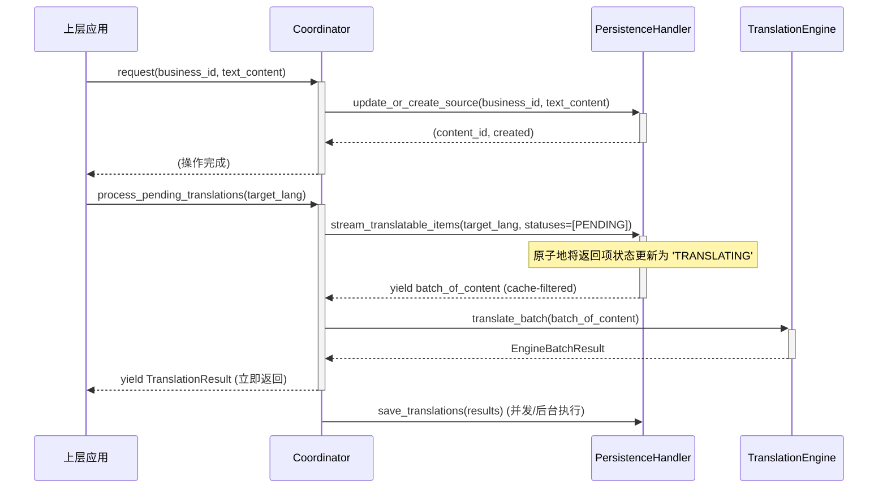

# **项目开发文档：`Trans-Hub` 核心引擎**

**版本**: 1.0
**文档状态**: **最终完整版 (Final & Complete)**
**目标读者**: 项目核心开发团队
**文档目的**: 本文档是`Trans-Hub`项目的权威技术规范，是所有v1.0开发工作的“单一事实来源”(Single Source of Truth)。它为开发者提供了从架构设计、数据模型到API契约的全部细节，旨在指导项目的完整、高质量开发。

---

## **目录**
1.  [项目概述与核心原则](#1-项目概述与核心原则)
2.  [系统架构与配置注入](#2-系统架构与配置注入)
3.  [数据模型与数据库设计](#3-数据模型与数据库设计)
4.  [插件发现与设计](#4-插件发现与设计)
5.  [核心接口与类设计](#5-核心接口与类设计)
6.  [错误处理与重试哲学](#6-错误处理与重试哲学)
7.  [日志记录与可观测性](#7-日志记录与可观测性)
8.  [典型工作流（顺序图）](#8-典型工作流顺序图)
9.  [高级翻译场景支持](#9-高级翻译场景支持)
10. [开发任务清单](#10-开发任务清单)
11. [附录A：配置项参考](#附录a配置项参考)
12. [附录B：术语表](#附录b术语表)
13. [附录C：第三方引擎开发指南（预告）](#附录c第三方引擎开发指南预告)

---

## **1. 项目概述与核心原则**

### **1.1 项目定位**

`Trans-Hub`是一个可嵌入Python应用程序的、带持久化存储的智能本地化（i18n）后端引擎。它旨在统一和简化多语言翻译工作流，通过智能缓存、插件化架构和健壮的设计，为上层应用提供高效、低成本、可靠的翻译能力。

### **1.2 核心工程原则**

*   **契约优先 (Contract First)**: 所有外部输入和内部模块交互都必须有严格的数据格式、类型和值域契约，并进行强制校验。
*   **结构化配置 (Structured Configuration)**: 系统的配置必须通过结构化的数据模型进行定义和验证，并以“快速失败”的原则在启动时进行校验。
*   **生命周期感知 (Lifecycle-Aware)**: 设计必须包含数据的演进（Schema迁移）和清理（垃圾回收）策略。
*   **职责明确 (Clear Separation of Concerns)**: 组件的职责应高度内聚，并通过清晰的接口进行协作。

---

## **2. 系统架构与配置注入**

### **2.1 系统架构**

`Trans-Hub`采用模块化的分层架构，确保各组件职责单一、易于测试和替换。



### **2.2 配置注入模式**
`Trans-Hub`的实例化采用明确的依赖注入模式。上层应用负责将所有配置加载到一个结构化的配置对象中，并将其作为参数传递给`Coordinator`。

### **2.3 设计哲学与未来演进**
在v1.0中，`Coordinator`承担了多重职责以简化初始设计。未来的版本（v2.0+）将考虑引入“策略模式”，将重试、限速等逻辑拆分为可配置的策略类，以进一步降低`Coordinator`的复杂度。

---

## **3. 数据模型与数据库设计**

### **3.1 数据库支持与要求**
*   **默认实现**: SQLite。**必须以WAL模式运行**。
*   **原子性要求**: `PersistenceHandler`的所有写操作**必须是事务性的**。
*   **数据库迁移**: 推荐将数据库迁移作为一个**独立的、显式调用的CLI命令**。

### **3.2 数据库Schema (最终版)**

#### `th_content` (内容表)
*   `id` (INTEGER PRIMARY KEY)
*   `value` (TEXT, UNIQUE) - *存储去重后的文本内容。*
*   `created_at` (TIMESTAMP)

#### `th_sources` (来源表)
*   `business_id` (TEXT, PRIMARY KEY) - *业务的唯一标识符。*
*   `content_id` (INTEGER, FK to `th_content.id`) - *关联的内容ID。*
*   `context_hash` (TEXT, NULLABLE)
*   `last_seen_at` (TIMESTAMP)
*   **索引**: `last_seen_at`索引, `content_id`外键索引。

#### `th_translations` (译文表)
*   `id` (INTEGER PRIMARY KEY)
*   `content_id` (INTEGER, FK to `th_content.id`, ON DELETE CASCADE)
*   `source_lang_code` (TEXT, NULLABLE)
*   `lang_code` (TEXT)
*   `context_hash` (TEXT, NULLABLE)
*   `translation_content` (TEXT)
*   `engine` (TEXT)
*   `engine_version` (TEXT, NOT NULL)
*   `score` (REAL, NULLABLE)
*   `status` (TEXT, CHECK(status IN ('PENDING', 'TRANSLATING', 'TRANSLATED', 'FAILED', 'APPROVED')))
*   `retry_count` (INTEGER, NOT NULL, DEFAULT 0)
*   `last_updated_at` (TIMESTAMP)
*   **约束**: `UNIQUE(content_id, lang_code, context_hash)`
*   **索引**: `(status, created_at)`复合索引, `content_id`外键索引。

### **3.3 上下文与数据更新策略**
*   `context`字段用于存储引擎特定的上下文信息，将通过确定的哈希函数（对规范化JSON字符串进行SHA256）生成`context_hash`。
*   `business_id`更新时，`Handler`将原子地更新`th_sources`表，旧的`content_id`将成为待回收数据。

### **3.4 垃圾回收 (GC)**
提供`coordinator.run_garbage_collection(...)`函数，清理过时的`th_sources`记录和不再被任何源或翻译引用的孤立`th_content`记录。

---

## **4. 插件发现与设计**

### **4.1 插件发现机制**
采用**Python Entry Points**机制，通过`trans_hub.engines`入口点组进行自动发现。`Coordinator`会安全地加载插件，捕获加载异常并记录警告。

### **4.2 `BaseTranslationEngine` 接口**
*   **职责**: 只负责单一、无状态的翻译转换逻辑。
*   **设计**:
    ```python
    class BaseTranslationEngine(ABC):
        CONFIG_MODEL: type[BaseEngineConfig]
        CONTEXT_MODEL: type[BaseContextModel] = BaseContextModel
        VERSION: str = "1.0.0"
        REQUIRES_SOURCE_LANG: bool = False
        
        def __init__(self, config: BaseEngineConfig): self.config = config

        @abstractmethod
        def translate_batch(self, texts: List[str], target_lang: str, context: Optional[BaseContextModel]) -> EngineBatchResult: ...
    ```

---

## **5. 核心接口与类设计**

### **5.1 `types.py`**
包含`TranslationStatus(Enum)`, `TranslationResult`, 以及健壮的`EngineBatchResult`（含`EngineSuccess`和`EngineError`）等DTOs。`EngineError`将包含`is_retryable: bool`字段。

### **5.2 `PersistenceHandler` 接口**
定义所有数据库交互，如`update_or_create_source`和`stream_translatable_items`。

### **5.3 `Coordinator`**
*   **职责**: 项目的总指挥中心，负责流程编排、策略执行、输入校验。
*   **核心API**:
    *   `request(business_id: Optional[str], text_content: str, ...)`: 统一的翻译请求入口。
        *   若`business_id`提供，则为“以字段名为基准”的模式。
        *   若`business_id`为`None`，则为“纯文本翻译”模式。
    *   `translate_adhoc(...)`: 为一次性、即用即弃的翻译场景提供。
*   **生命周期管理**: 提供`close()`或`shutdown()`方法，确保后台任务优雅完成。
*   **同步/异步隔离**: 提供独立的`Coordinator`和`AsyncCoordinator`类。
*   **并发处理**: 引入基于数据库的`'TRANSLATING'`状态锁和“僵尸任务”恢复机制。

---

## **6. 错误处理与重试哲学**

`Coordinator`将实现一个基于`EngineError.is_retryable`的、可配置的、带指数退避的重试策略。

---

## **7. 日志记录与可观测性**

*   **格式**: 推荐使用**JSON格式**的结构化日志。
*   **调用链ID**: 使用`contextvars`来传递和记录`correlation_id`。
*   **关键日志事件**:
| 等级      | 事件标识                     | 说明     |
| ------- | ------------------------ | ------ |
| `INFO`    | `engine.request.start`   | 发起翻译请求 |
| `INFO`    | `engine.request.success` | 翻译成功   |
| `WARNING` | `engine.request.failure` | 翻译请求失败 |
| `DEBUG`   | `translation.cache.hit`  | 命中翻译缓存 |
| `DEBUG`   | `translation.cache.miss` | 未命中缓存  |
| `INFO`    | `gc.run.start`           | 垃圾回收开始 |
| `INFO`    | `gc.run.end`             | 垃圾回收结束 |

---

## **8. 典型工作流（顺序图）**



---

## **9. 高级翻译场景支持**

`Trans-Hub`的架构设计使其能够支持更多高级翻译场景：

*   **翻译记忆库 (Translation Memory)**: 持久化的`th_content`和`th_translations`表是实现模糊匹配的基础。
*   **术语表 (Glossary)**: 可通过`context`机制注入术语表。
*   **A/B测试**: 可通过为不同的翻译版本分配不同的`business_id`或`context`来实现。

---

## **10. 开发任务清单**

**Milestone 0: Tooling & CI (工具链与持续集成)**
1.  [ ] **配置**: `pyproject.toml`, `black`, `isort`, `mypy`, `ruff`。
2.  [ ] **测试**: `pytest`, `pytest-cov`。
3.  [ ] **CI**: 建立GitHub Actions流水线。

**Milestone 1: Foundation (基础架构)**
4.  [ ] **`types.py` & `utils.py`**: 实现所有DTOs, Enums, 和校验函数（含`generate_context_hash`）。
5.  [ ] **数据库**: 实现`schema_manager`和`001_initial.sql`（含索引）。
6.  [ ] **接口**: 定义`interfaces.py`和`engines/base.py`，并为每个接口提供一个Mock实现用于测试。
7.  [ ] **单元测试**: 为以上所有模块编写单元测试。

**Milestone 2: Core Implementation (核心实现)**
8.  [ ] **数据库处理器**: 实现`DefaultPersistenceHandler`和`AsyncPersistenceHandler`。
9.  [ ] **引擎系统**: 实现`entry_points`发现机制，并开发`DebugEngine`和`DeepLEngine`。
10. [ ] **错误处理与限速模块**: 实现中心化的、基于错误分类的重试策略模块。
11. [ ] **速率限制器实现**: 实现中心化的速率限制模块。
12. [ ] **主协调器**: 完成`Coordinator`，集成所有子模块。
13. [ ] **集成测试**: 编写完整的端到端流程测试。

**Milestone 3: Finalization & Polish (收尾与打磨)**
14. [ ] **异步支持**: 完整实现`AsyncCoordinator`和同步/异步隔离机制。
15. [ ] **生命周期工具**: 实现`run_garbage_collection`（含`dry_run`模式）和管理CLI。
16. [ ] **日志记录**: 集成结构化的、带`correlation_id`的日志记录。
17. [ ] **性能基准测试与压力测试**: 对高并发场景进行测试。
18. [ ] **文档**: 编写用户文档（README, Cookbook/示例）和**明确完成并发布《第三方引擎开发指南》**。
19. [ ] **打包**: 配置`pyproject.toml`，准备项目发布。

---

## **附录A：配置项参考**

```python
from typing import Optional, Dict, Any, Literal
from pydantic import BaseModel, Field

# --- Engine Specific Config Models ---
class DeepLEngineConfig(BaseModel):
    api_key: str
    server_url: str = "https://api-free.deepl.com"

class GoogleEngineConfig(BaseModel):
    project_id: str
    # ...

# --- Core Policy Config Models ---
class LoggingConfig(BaseModel):
    level: str = "INFO"
    format: Literal["json", "text"] = "json"

class RetryPolicyConfig(BaseModel):
    max_attempts: int = 3
    initial_backoff: float = 1.0
    max_backoff: float = 60.0
    jitter: bool = True

class EngineConfigs(BaseModel):
    deepl: Optional[DeepLEngineConfig] = None
    google: Optional[GoogleEngineConfig] = None
    # ...

# --- Main Config Model ---
class TransHubConfig(BaseModel):
    database_url: str
    active_engine: str
    engine_configs: EngineConfigs
    retry_policy: RetryPolicyConfig = Field(default_factory=RetryPolicyConfig)
    logging: LoggingConfig = Field(default_factory=LoggingConfig)
```

## **附录B：术语表**
*   **内容 (Content)**: 在`th_content`表中存储的、去重后的、唯一的文本字符串。
*   **业务ID (business_id)**: 上层应用传入的、全局唯一的静态字符串，用于追踪一个业务位置与特定内容（Content）的关联。
*   **上下文哈希 (context_hash)**: 基于引擎特定上下文内容的哈希，用于细粒度缓存命中。
*   **入口点 (Entry Points)**: Python包分发标准的一部分，允许一个包将其对象“广告”给其他包，实现插件化。

## **附录C：第三方引擎开发指南（预告）**
本附录将详细指导社区开发者如何创建自己的翻译引擎插件包，包括如何定义`CONFIG_MODEL`、`CONTEXT_MODEL`以及如何通过`entry_points`进行注册。`Coordinator`会负责调用引擎的`CONTEXT_MODEL`来验证和结构化传入的`context`字典，开发者无需在引擎内部进行校验。

## **附录D：`business_id` 命名指南与最佳实践**

### **D.1 设计哲学：为何使用单一字符串**

`Trans-Hub`的核心设计之一是使用一个单一的、灵活的字符串`business_id`来唯一标识一个翻译来源。我们没有选择将其拆分为多个固定的数据库字段（如`domain`, `component`, `key`），原因如下：

*   **极致的灵活性**: 不同的翻译场景有截然不同的标识需求。单一字符串可以容纳任何结构，无论是简单的键值对，还是复杂的文件路径、时间戳或数据库ID。
*   **避免过度设计**: 试图用一套固定的结构去预设所有可能的业务场景是不现实的，这会使系统变得僵化且难以适应未来的需求。
*   **API简洁性**: 保持了`request()`接口的简洁性，降低了使用者的心智负担。

为了在这种灵活性和项目管理的可维护性之间取得平衡，我们**强烈推荐**遵循一套统一的命名约定。

### **D.2 推荐的命名约定**

我们推荐使用一种**带命名空间的、点分式的路径结构**来构建您的`business_id`。

**基本格式**:
`domain.subdomain.component1.component2...key`

*   **分隔符**: 使用点 `.` 作为层级之间的分隔符。
*   **字符集**: 建议只使用**小写字母、数字、下划线 `_` 和横杠 `-`**。这能确保ID在各种系统（URL、文件名等）中都是安全的。
*   **全局唯一**: 每一个`business_id`在您的整个项目中都必须是唯一的。

### **D.3 典型翻译场景的命名示例**

以下是针对您提到的各种翻译场景，我们推荐的具体命名实践。

#### **场景1：翻译UI界面文本**

这是最常见的场景。`business_id`应该能清晰地反映出文本在UI中的位置和层级。

*   **格式**: `ui.{page_or_window}.{section_or_group}.{element_name}.{attribute}`
*   **示例**:
    *   登录页面的标题: `ui.login_page.title`
    *   设置对话框中“通用”选项卡的保存按钮: `ui.settings_dialog.tabs.general.save_button`
    *   用户菜单中的“退出登录”项的提示文本: `ui.user_menu.logout.tooltip`

#### **场景2：翻译配置文件（如JSON, YAML）**

对于结构化的配置文件，`business_id`应该模拟其在文件中的路径。

*   **格式**: `config.{filename_or_group}.{path.to.key}`
*   **示例**: 对于Obsidian插件的`manifest.json`：
    *   `name`字段: `config.obsidian_plugin.manifest.name`
    *   `description`字段: `config.obsidian_plugin.manifest.description`
    *   如果一个插件有多个配置文件，可以这样：`config.my_plugin.settings.appearance.theme_name`

#### **场景3：翻译字幕文件（如SRT, VTT）**

字幕的标识需要包含文件名和时间/位置信息，以确保唯一性。

*   **格式**: `subtitle.{filename}.{identifier_type}.{identifier_value}`
*   **示例**:
    *   按行号: `subtitle.s01e01.srt.line.123` (第一季第一集的SRT文件的第123行)
    *   按时间戳: `subtitle.movie_intro.vtt.ts.00_01_15_250` (movie_intro.vtt文件在1分15秒250毫秒处的字幕)
    *   按ID（如果字幕格式支持）: `subtitle.feature_film.ass.dialogue.warning_sign`

#### **场景4：翻译数据库内容**

当需要翻译存储在数据库中的内容时（例如产品描述），`business_id`应包含表名和记录的主键。

*   **格式**: `db.{table_name}.{record_id}.{field_name}`
*   **示例**:
    *   `products`表中ID为`42`的产品的`description`字段: `db.products.42.description`
    *   `categories`表中ID为`5`的`name`字段: `db.categories.5.name`

#### **场景5：翻译纯文本（即席翻译）**

当您只需要翻译一段临时文本，不关心其来源，也不需要长期追踪时。

*   **格式**: 不提供`business_id`，将其设为`None`。
*   **示例**:
    ```python
    user_input = "Can you translate this for me?"
    coordinator.request(
        business_id=None,
        text_content=user_input
    )
    ```
*   **工作模式**: 在这种模式下，`Trans-Hub`将退化为一个**基于文本内容的高效缓存翻译器**。它会直接使用`text_content`在`th_content`和`th_translations`中进行查找和存储，完全跳过`th_sources`表。

### **D.4 总结：设计您自己的命名空间**

`Trans-Hub`赋予您定义自己命名空间的全部能力。关键在于**保持一致性、可读性和唯一性**。一个好的`business_id`命名规范将使您的本地化项目在规模扩大时依然能够保持清晰和易于管理。在项目开始时，花时间与团队一起制定一套适用于您自己业务的命名约定，将是一项非常有价值的投资。