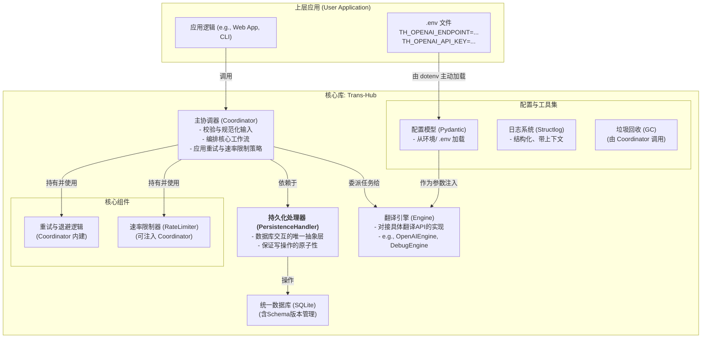
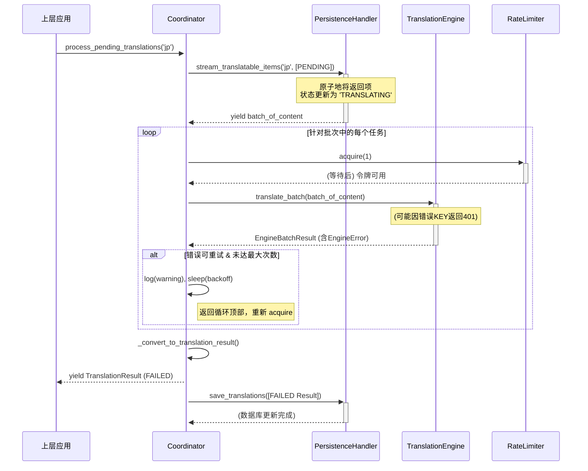

# **项目开发文档：`Trans-Hub` 核心引擎**

**版本**: 1.0.1
**文档状态**: **最终发布版 (Final, Released)**
**目标读者**: 项目核心开发团队, 未来维护者, 社区贡献者
**文档目的**: 本文档是 `Trans-Hub` 项目 v1.0 的权威技术规范与最终实现记录，是所有开发与维护工作的“单一事实来源”(Single Source of Truth)。它详尽地描述了从架构设计、数据模型、核心实现到部署配置的全部细节，旨在确保项目的长期可维护性、可扩展性与高质量。

---

## **目录**
1.  [项目概述与核心原则](#1-项目概述与核心原则)
2.  [系统架构与配置注入](#2-系统架构与配置注入)
3.  [数据模型与数据库设计 (最终版)](#3-数据模型与数据库设计-最终版)
4.  [插件化翻译引擎设计](#4-插件化翻译引擎设计)
5.  [核心模块与类设计](#5-核心模块与类设计)
6.  [核心工作流详解](#6-核心工作流详解)
7.  [错误处理、重试与速率限制](#7-错误处理重试与速率限制)
8.  [日志记录与可观测性](#8-日志记录与可观测性)
9.  [附录A：配置指南 (`.env`)](#附录a配置指南-env)
10. [附录B：术语表](#附录b术语表)
11. [附录C：第三方引擎开发指南](#附录c第三方引擎开发指南)

---

## **1. 项目概述与核心原则**

### **1.1 项目定位**

`Trans-Hub` 是一个可嵌入 Python 应用程序的、带持久化存储的智能本地化（i18n）后端引擎。它旨在统一和简化多语言翻译工作流，通过智能缓存、可插拔的翻译引擎、以及健壮的错误处理和策略控制，为上层应用提供高效、低成本、高可靠的翻译能力。

### **1.2 核心工程原则**

*   **契约优先 (Contract First)**: 所有外部输入和内部模块交互都通过严格的 DTOs (Data Transfer Objects, 使用 Pydantic 定义) 进行约束，确保类型安全和数据一致性。
*   **结构化配置 (Structured Configuration)**: 系统的所有配置项（如数据库路径、API密钥）均通过结构化的 Pydantic 模型进行定义和验证。配置加载遵循 **环境优先** 的原则，并支持使用 `.env` 文件进行本地开发。
*   **依赖注入 (Dependency Injection)**: 核心组件（如 `Coordinator`）在其构造函数中接收其依赖（如 `PersistenceHandler`, `Engine`），使得组件之间松耦合，易于测试和替换。
*   **生命周期感知 (Lifecycle-Aware)**: 系统设计包含了数据的演进（通过独立的迁移脚本）和清理（通过垃圾回收GC功能），确保长期运行的健康性。
*   **职责明确 (Clear Separation of Concerns)**: 各组件职责高度内聚。`PersistenceHandler` 只管数据库，`Engine` 只管翻译API，`Coordinator` 只管编排。

---

## **2. 系统架构与配置注入**

### **2.1 系统架构**

`Trans-Hub` 采用模块化的分层架构，确保各组件职责单一、易于测试和替换。



### **2.2 配置加载与注入模式**
1.  **主动加载**: 强烈建议上层应用在启动时，首先调用 `dotenv.load_dotenv()`，将 `.env` 文件中的配置显式加载到环境变量中。这是最健壮、最能抵抗环境干扰的方式。
2.  **模型解析**: 各组件的配置模型（如 `OpenAIEngineConfig`）继承自 `pydantic_settings.BaseSettings`，它会自动从环境变量中解析和验证配置。
3.  **依赖注入**: 上层应用负责创建所有组件的实例（如 `PersistenceHandler`, `OpenAIEngine`），并将它们作为参数注入到 `Coordinator` 的构造函数中。

---

## **3. 数据模型与数据库设计 (最终版)**

### **3.1 数据库支持与要求**
*   **默认实现**: SQLite。为保证并发性能，**必须以WAL模式运行**。
*   **原子性要求**: `PersistenceHandler` 的所有写操作**必须是事务性的**。
*   **数据库迁移**: 迁移通过独立的 `schema_manager.py` 和 SQL 文件进行管理，应作为显式的部署步骤执行，而不是在程序运行时自动执行。

### **3.2 数据库 Schema (v1.0)**

#### `th_content` (内容表)
*   **职责**: 存储所有唯一的、去重后的文本字符串，作为所有翻译的源头。
*   `id` (INTEGER PRIMARY KEY)
*   `value` (TEXT, UNIQUE): 文本内容本身。
*   `created_at` (TIMESTAMP)

#### `th_sources` (来源表)
*   **职责**: 建立业务逻辑中的标识符 (`business_id`) 与具体内容 (`content_id`) 之间的关联。
*   `business_id` (TEXT, PRIMARY KEY): 上层应用定义的唯一业务标识符。
*   `content_id` (INTEGER, FK to `th_content.id`): 关联的内容ID。
*   `context_hash` (TEXT, NULLABLE): 关联的上下文哈希。
*   `last_seen_at` (TIMESTAMP): 用于垃圾回收的时间戳，每次 `request` 时更新。
*   **索引**: `(last_seen_at)`, `(content_id)`。

#### `th_translations` (译文表)
*   **职责**: 存储一个内容针对特定语言和上下文的翻译结果及其元数据。
*   `id` (INTEGER PRIMARY KEY)
*   `content_id` (INTEGER, FK to `th_content.id`, ON DELETE CASCADE): 关联的内容ID。
*   `source_lang_code` (TEXT, NULLABLE): 源语言，`NULL` 表示由引擎自动检测。
*   `lang_code` (TEXT): 目标语言。
*   `context_hash` (TEXT, NULLABLE): 上下文哈希，`NULL` 表示全局翻译。
*   `translation_content` (TEXT): 翻译后的文本。
*   `engine` (TEXT): 执行翻译的引擎名称。
*   `engine_version` (TEXT, NOT NULL): 引擎的版本号。
*   `score` (REAL, NULLABLE): 翻译质量得分。
*   `status` (TEXT): `PENDING`, `TRANSLATING`, `TRANSLATED`, `FAILED`, `APPROVED`。
*   `retry_count` (INTEGER): 重试次数。
*   `last_updated_at` (TIMESTAMP): 记录的最后更新时间。
*   **约束**: `UNIQUE(content_id, lang_code, context_hash)` 保证了翻译的唯一性。
*   **索引**: `(status, last_updated_at)`, `(content_id)`。

### **3.3 垃圾回收 (GC)**
`Coordinator.run_garbage_collection()` 方法执行以下两步清理：
1.  删除 `th_sources` 中 `last_seen_at` 早于保留期限的记录。
2.  删除 `th_content` 中**不再被任何 `th_sources` 或 `th_translations` 记录引用**的“孤立”记录。这是一个级联效应，第一步的操作可能会产生新的孤立内容。

---

## **4. 插件化翻译引擎设计**

### **4.1 插件发现机制**
v1.0 暂未实现基于 Entry Points 的自动发现，而是采用**显式注入**的方式：在上层应用中创建引擎实例字典，并将其传递给 `Coordinator`。这简化了初始设计，同时保留了未来扩展到 Entry Points 的可能性。

### **4.2 `BaseTranslationEngine` 接口**
所有翻译引擎必须继承的抽象基类，定义了引擎的核心契约。

```python
# trans_hub/engines/base.py
class BaseTranslationEngine(ABC):
    # Pydantic 配置模型，Coordinator 用它来验证传入的引擎配置
    CONFIG_MODEL: type[BaseEngineConfig]
    # Pydantic 上下文模型，用于验证特定于引擎的上下文
    CONTEXT_MODEL: type[BaseContextModel] = BaseContextModel
    # 引擎的版本号
    VERSION: str = "1.0.0"
    # 引擎是否必须提供源语言
    REQUIRES_SOURCE_LANG: bool = False
    
    def __init__(self, config: BaseEngineConfig): self.config = config

    @abstractmethod
    def translate_batch(self, ...) -> List[EngineBatchItemResult]: ...
    
    @abstractmethod
    async def atranslate_batch(self, ...) -> List[EngineBatchItemResult]: ...
```

---

## **5. 核心模块与类设计**

### **5.1 `types.py`**
定义了所有核心 DTOs，是系统的“血液”。关键 DTO 包括：
*   `TranslationStatus(Enum)`: 翻译任务的生命周期状态。
*   `EngineSuccess`, `EngineError`: 引擎返回的原子结果。`EngineError` 包含 `is_retryable` 标志，是重试逻辑的基础。
*   `TranslationResult`: `Coordinator` 返回给用户的、包含完整信息的综合结果。
*   `ContentItem`: `Coordinator` 与 `PersistenceHandler` 之间传递的待翻译任务单元。

### **5.2 `PersistenceHandler` (`persistence.py`)**
数据库交互的接口及其同步实现 `DefaultPersistenceHandler`。它封装了所有 SQL 查询，并使用 `with self.transaction()` 上下文管理器来确保所有写操作的原子性。

### **5.3 `Coordinator` (`coordinator.py`)**
项目的“大脑”，通过依赖注入持有 `PersistenceHandler` 和引擎实例。
*   `request()`: 接收翻译请求，负责创建源记录和 `PENDING` 状态的翻译任务。
*   `process_pending_translations()`: 核心后台处理方法，负责获取任务、调用引擎、处理结果、执行重试和限速、并保存最终结果。这是一个流式（生成器）方法，可以立即返回处理结果。
*   `run_garbage_collection()`: 暴露给上层应用的垃圾回收接口。

### **5.4 `RateLimiter` (`rate_limiter.py`)**
一个基于令牌桶算法的、线程安全的速率限制器。通过 `acquire()` 方法阻塞执行，直到有可用令牌，从而平滑 API 调用速率。

---

## **6. 核心工作流详解**

以下是 `process_pending_translations` 的详细工作流：



---

## **7. 错误处理、重试与速率限制**

*   **错误分类**: `EngineError.is_retryable` 是错误分类的核心。API 返回的 `5xx` 或 `429` (Too Many Requests) 状态码通常被视为可重试，而 `4xx` (如 `401 Unauthorized`, `400 Bad Request`) 则被视为不可重试。
*   **重试策略**: `Coordinator` 内建了一个带**指数退避 (Exponential Backoff)** 的重试循环。每次失败后，等待时间会翻倍 (`initial_backoff * (2 ** attempt)`)，以避免在短时间内频繁冲击过载的服务器。
*   **速率限制**: 在**每次**尝试调用引擎 API 之前（包括重试），`Coordinator` 都会调用 `rate_limiter.acquire()`，确保即使在重试风暴中，API 调用速率也始终处于受控状态。

---

## **8. 日志记录与可观测性**

*   **库**: 使用 `structlog` 实现结构化日志，`python-dotenv` 辅助配置。
*   **格式**: 开发环境使用彩色的控制台格式，生产环境推荐切换为 `json` 格式，便于日志聚合系统（如 ELK, Splunk）的采集和分析。
*   **调用链ID**: 使用 `structlog.contextvars` 和 `uuid` 实现 `correlation_id` 的绑定和传递。这使得可以轻松地从海量日志中筛选出与单次请求相关的所有日志记录，是微服务和复杂系统调试的利器。

---

## **附录A：配置指南 (`.env`)**

项目配置应通过在项目根目录下创建 `.env` 文件来管理。建议在程序入口处调用 `dotenv.load_dotenv()` 来主动加载。

**示例 `.env` 文件:**
```env
# Trans-Hub 配置文件
# 使用前缀以避免与其他应用的环境变量冲突。

# --- OpenAI 引擎配置 ---
# [重要] 替换为你的 API 地址。
# 使用 ENDPOINT 而不是 BASE_URL 是为了避免我们遇到的解析问题。
TH_OPENAI_ENDPOINT="https://api.oneabc.org/v1"

# 你的 API 密钥。
TH_OPENAI_API_KEY="your-real-or-dummy-key"

# 你希望使用的模型。
TH_OPENAI_MODEL="gpt-3.5-turbo"
```

---

## **附录B：术语表**
*   **内容 (Content)**: 在`th_content`表中存储的、去重后的、唯一的文本字符串。
*   **业务ID (business_id)**: 上层应用传入的、全局唯一的静态字符串，用于追踪一个业务位置与特定内容的关联。
*   **上下文哈希 (context_hash)**: 基于引擎特定上下文内容的 SHA256 哈希，用于细粒度缓存命中。
*   **DTO (Data Transfer Object)**: 数据传输对象，在本项目中指用 Pydantic 定义的、用于模块间数据交换的模型类。

---

## **附录C：第三方引擎开发指南**

要为 `Trans-Hub` 开发一个新的翻译引擎，你需要遵循以下步骤：

1.  **创建配置模型**:
    ```python
    from pydantic_settings import BaseSettings, SettingsConfigDict
    
    class YourEngineConfig(BaseSettings):
        model_config = SettingsConfigDict(...)
        your_api_key: str = Field(validation_alias='TH_YOURENGINE_API_KEY')
        # ... 其他配置
    ```
2.  **创建引擎类**:
    ```python
    from trans_hub.engines.base import BaseTranslationEngine
    
    class YourEngine(BaseTranslationEngine):
        CONFIG_MODEL = YourEngineConfig
        VERSION = "1.0.0"
        
        def __init__(self, config: YourEngineConfig):
            super().__init__(config)
            # 初始化你的 API 客户端，例如
            # self.client = YourApiClient(api_key=config.your_api_key)
            
        def translate_batch(self, ...):
            # 实现你的翻译逻辑
            # ...
            # 成功时返回 EngineSuccess(...)
            # 失败时返回 EngineError(..., is_retryable=...)
            
        async def atranslate_batch(self, ...):
            # 实现异步版本
            ...
    ```
3.  **在上层应用中使用**:
    ```python
    # 在你的应用代码中
    from dotenv import load_dotenv
    from trans_hub.coordinator import Coordinator
    from your_engine_file import YourEngine, YourEngineConfig
    
    load_dotenv() # 加载 .env
    
    your_engine_config = YourEngineConfig()
    your_engine = YourEngine(config=your_engine_config)
    
    engines = {"your_engine_name": your_engine}
    
    coordinator = Coordinator(
        # ... 其他依赖 ...
        engines=engines,
        active_engine_name="your_engine_name"
    )
    ```

### **附录D：`business_id` 命名指南与最佳实践 (补全)**

`business_id` 是 `Trans-Hub` 设计中的一个核心概念。它是一个由上层应用定义的、全局唯一的字符串，其主要目的是**将一段具体的文本内容（Content）与它在业务逻辑中出现的“位置”或“来源”进行稳定地关联**。一个设计良好的 `business_id` 命名体系是实现高效、可维护本地化工作流的关键。

#### **D.1 设计哲学：为何使用单一字符串**

`Trans-Hub` 没有将来源标识拆分为多个固定的数据库字段（如 `domain`, `component`, `key`），而是选择使用一个灵活的、单一的字符串 `business_id`。这基于以下考量：

*   **极致的灵活性**: 不同的翻译场景有截然不同的标识需求。单一字符串可以容纳任何结构，无论是简单的键值对，还是复杂的文件路径、时间戳或数据库记录ID。
*   **避免过度设计**: 试图用一套固定的结构去预设所有可能的业务场景是不现实的，这会使系统变得僵化且难以适应未来的需求。例如，一个UI文本的标识方式与一个字幕文件的标识方式可能完全不同。
*   **API简洁性**: 保持了 `request()` 接口的简洁性，降低了使用者的学习成本和心智负担。

为了在这种灵活性和项目管理的可维护性之间取得平衡，我们**强烈推荐**团队内部遵循一套统一的命名约定。

#### **D.2 推荐的命名约定**

我们推荐使用一种**带命名空间的、点分式的路径结构**来构建你的 `business_id`。这种方式易于阅读、排序和过滤。

**基本格式**:
`domain.subdomain.component1.component2...key`

*   **分隔符**: 使用点 `.` 作为层级之间的分隔符。
*   **字符集**: 建议只使用**小写字母、数字、下划线 `_` 和横杠 `-`**。这能确保ID在各种系统（URL、文件名、代码变量等）中都是安全的。
*   **全局唯一**: 每一个 `business_id` 在你的整个项目中都必须是唯一的。

#### **D.3 典型翻译场景的命名示例**

以下是针对不同翻译场景，我们推荐的具体命名实践。

##### **场景1：翻译UI界面文本 (最常见)**

`business_id` 应该能清晰地反映出文本在UI中的位置和层级。

*   **格式**: `ui.{page_or_window}.{section_or_group}.{element_name}.{attribute_or_state}`
*   **示例**:
    *   登录页面的标题: `ui.login_page.title`
    *   设置对话框中“通用”选项卡的保存按钮: `ui.settings_dialog.tabs.general.save_button`
    *   用户菜单中的“退出登录”项的提示文本: `ui.user_menu.logout.tooltip`
    *   一个输入框的占位符文本: `ui.search.input.placeholder`

##### **场景2：翻译配置文件（如JSON, YAML）**

对于结构化的配置文件，`business_id` 应该模拟其在文件中的路径。

*   **格式**: `config.{filename_or_group}.{path.to.key}`
*   **示例**: 对于一个插件的 `manifest.json` 文件：
    *   `name` 字段: `config.my_plugin.manifest.name`
    *   `description` 字段: `config.my_plugin.manifest.description`
    *   如果一个插件有多个配置文件，可以这样：`config.my_plugin.settings.appearance.theme_name`

##### **场景3：翻译字幕文件（如SRT, VTT）**

字幕的标识需要包含文件名和时间/位置信息，以确保唯一性。

*   **格式**: `subtitle.{filename}.{identifier_type}.{identifier_value}`
*   **示例**:
    *   按行号: `subtitle.s01e01.srt.line.123` (第一季第一集的SRT文件的第123行)
    *   按时间戳: `subtitle.movie_intro.vtt.ts.00-01-15-250` (使用 `-` 替代 `.` 和 `:` 以保持格式一致)
    *   按ID（如果字幕格式支持）: `subtitle.feature_film.ass.dialogue.warning_sign`

##### **场景4：翻译数据库内容**

当需要翻译存储在数据库中的内容时（例如产品描述），`business_id` 应包含表名和记录的主键。

*   **格式**: `db.{table_name}.{record_id}.{field_name}`
*   **示例**:
    *   `products` 表中ID为 `42` 的产品的 `description` 字段: `db.products.42.description`
    *   `categories` 表中ID为 `5` 的 `name` 字段: `db.categories.5.name`

##### **场景5：翻译纯文本内容（即席翻译）**

当您只需要翻译一段临时文本（例如用户输入），不关心其来源，也不需要长期追踪其业务位置时。

*   **`business_id`**: 在调用 `request()` 方法时，将 `business_id` 参数设为 `None`。
*   **示例**:
    ```python
    user_input = "Can you translate this for me?"
    coordinator.request(
        target_langs=['fr'],
        text_content=user_input,
        business_id=None  # 明确表示这是一个即席翻译
    )
    ```
*   **工作模式**: 在这种模式下，`Trans-Hub` 将退化为一个**基于文本内容的高效缓存翻译器**。它会直接使用 `text_content` 在 `th_content` 和 `th_translations` 中进行查找和存储，完全跳过 `th_sources` 表。这对于处理动态、非结构化的文本非常有用。

#### **D.4 总结：设计您自己的命名空间**

`Trans-Hub` 赋予您定义自己命名空间的全部能力。关键在于**保持一致性、可读性和唯一性**。一个好的 `business_id` 命名规范将使您的本地化项目在规模扩大时依然能够保持清晰和易于管理。在项目开始时，花时间与团队一起制定一套适用于您自己业务的命名约定，将是一项非常有价值的投资。

---