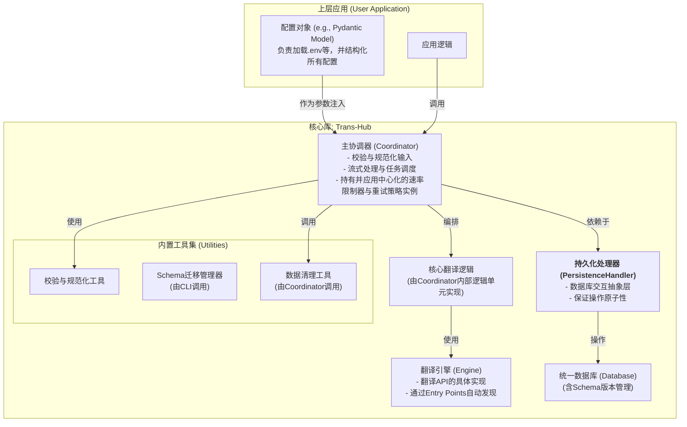
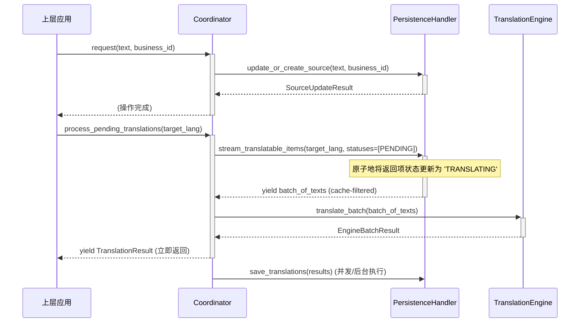

### **项目开发文档：`Trans-Hub` 核心引擎**

**版本**: 1.0
**文档状态**: **最终批准版 (Final, Approved)**
**目标读者**: 项目核心开发团队
**文档目的**: 本文档是`Trans-Hub`项目的权威技术规范，是所有v1.0开发工作的“单一事实来源”(Single Source of Truth)。它为开发者提供了从架构设计、数据模型到API契约的全部细节，旨在指导项目的完整、高质量开发。

---

### **目录**
- [**项目开发文档：`Trans-Hub` 核心引擎**](#项目开发文档trans-hub-核心引擎)
- [**目录**](#目录)
- [**1. 项目概述与核心原则**](#1-项目概述与核心原则)
- [**2. 系统架构与配置注入**](#2-系统架构与配置注入)
- [**3. 数据模型与数据库设计**](#3-数据模型与数据库设计)
  - [**4. 插件发现与设计**](#4-插件发现与设计)
  - [**5. 核心接口与类设计**](#5-核心接口与类设计)
  - [**6. 错误处理与重试哲学**](#6-错误处理与重试哲学)
  - [**7. 日志记录与可观测性**](#7-日志记录与可观测性)
  - [**8. 典型工作流（顺序图）**](#8-典型工作流顺序图)
  - [**9. 开发任务清单**](#9-开发任务清单)
- [**附录A：配置项参考**](#附录a配置项参考)
- [**附录B：术语表**](#附录b术语表)
- [**附录C：第三方引擎开发指南（预告）**](#附录c第三方引擎开发指南预告)

---

### **1. 项目概述与核心原则**

**1.1 项目定位**

`Trans-Hub`是一个可嵌入Python应用程序的、带持久化存储的智能本地化（i18n）后端引擎。它旨在统一和简化多语言翻译工作流，通过智能缓存、插件化架构和健壮的设计，为上层应用提供高效、低成本、可靠的翻译能力。

**1.2 核心工程原则**

*   **契约优先**: 所有外部输入和内部模块交互都必须有严格的数据格式、类型和值域契约，并进行强制校验。
*   **结构化配置**: 系统的配置必须通过结构化的数据模型进行定义和验证，并以“快速失败”的原则在启动时进行校验。
*   **生命周期感知**: 设计必须包含数据的演进（Schema迁移）和清理（垃圾回收）策略。
*   **职责明确**: 组件的职责应高度内聚，并通过清晰的接口进行协作。

---

### **2. 系统架构与配置注入**

**2.1 系统架构**

`Trans-Hub`采用模块化的分层架构，确保各组件职责单一、易于测试和替换。


*注: `C`（核心翻译逻辑）是`Coordinator`内部的一组私有方法或逻辑单元（如`_process_batch`），负责执行由`B`调度的具体任务。*

**2.2 配置注入模式**

`Trans-Hub`的实例化采用明确的依赖注入模式。上层应用负责将所有配置加载到一个结构化的配置对象中，并将其作为参数传递给`Coordinator`。

---

### **3. 数据模型与数据库设计**

**3.1 数据库支持与要求**

*   **默认实现**: SQLite。**必须以WAL模式运行**。
*   **原子性要求**: `PersistenceHandler`的所有写操作**必须是事务性的**。
*   **数据库迁移**: 推荐将数据库迁移作为一个**独立的、显式调用的CLI命令**（如`trans-hub migrate`）或启动脚本步骤，而非在库的实例化过程中自动执行，以避免在多实例环境中产生竞争条件。

**3.2 数据库Schema**

*   **`th_meta`**: `key` (PK, e.g., 'schema_version'), `value` (e.g., '1')
*   **`th_texts`**: `id` (PK), `text_content` (UNIQUE), `created_at`
*   **`th_translations`**:
    *   `id` (PK), `text_id` (FK, ON DELETE CASCADE), `source_lang_code` (TEXT, NULLABLE), `lang_code` (TEXT), `context_hash` (TEXT, NULLABLE), `translation_content` (TEXT), `engine` (TEXT), `engine_version` (TEXT NOT NULL), `score` (REAL, NULLABLE), `status` (TEXT CHECK(status IN ('PENDING', 'TRANSLATING', 'TRANSLATED', 'FAILED', 'APPROVED')) NOT NULL), `retry_count` (INTEGER NOT NULL DEFAULT 0), `last_updated_at` (TIMESTAMP)
    *   **约束**: `UNIQUE(text_id, lang_code, context_hash)`
    *   `source_lang_code`为`NULL`表示源语言未知，由翻译引擎自行检测。
    *   `context_hash`为`NULL`表示无特定上下文的全局翻译。
    *   对于非引擎生成的记录（如人工校对），`engine`可设为`'manual'`，`engine_version`可设为`'1.0'`。
*   **`th_sources`**:
    *   `business_id` (TEXT, PK): 业务ID。`business_id`被设计为业务系统中一个文本来源的唯一标识符，与一个特定的（文本内容，上下文）组合是严格的一对一映射关系。
    *   `text_id` (INTEGER, FK to `th_texts.id`): 关联的文本ID。
    *   `context_hash` (TEXT, NULLABLE): 与此次关联绑定的上下文哈希。
    *   `last_seen_at` (TIMESTAMP): 最近一次被`request()`方法调用时的时间戳，用于GC。
*   **索引 (Indexes)**:
    *   `th_translations`: `(status, created_at)`复合索引, `text_id`外键索引。
    *   `th_sources`: `last_seen_at`索引, `text_id`外键索引。

**3.3 上下文与数据更新策略**

*   **`context`字段**: 用于存储**引擎特定**的上下文信息。将通过一个确定的哈希函数生成`context_hash`。
*   **人工校对/覆盖**: 通过**更新**`th_translations`表中对应的记录来实现。
*   **`business_id`更新**: 当`request()`接收到已存在的`business_id`但`text`不同时，`Handler`将原子地更新`th_sources`表。旧的`text_id`及其翻译将与此`business_id`解耦，成为待回收数据。

**3.4 垃圾回收 (GC)**

提供`coordinator.run_garbage_collection(retention_days: int, dry_run: bool = False)`函数。
*   **清理对象**:
    1.  **过时的源**: `th_sources`中`last_seen_at`早于`retention_days`的记录。
    2.  **孤立的文本**: 一个`th_texts`记录是可被回收的，当且仅当它不再被任何`th_sources`记录所引用，并且其创建时间早于`retention_days`。

---

#### **4. 插件发现与设计**

**4.1 插件发现机制**

采用**Python Entry Points**机制，通过`trans_hub.engines`入口点组进行自动发现。

**4.2 `BaseTranslationEngine` 接口**

*   **职责**: 只负责**单一、无状态**的翻译转换逻辑。这里的“无状态”指其`translate_batch`方法是可重入的。引擎实例本身可以持有从配置初始化的长生命周期对象（如`aiohttp.ClientSession`）。
*   **设计**:
    ```python
    # trans_hub/engines/base.py
    from pydantic import BaseModel

    class BaseContextModel(BaseModel): pass
    
    class BaseEngineConfig(BaseModel):
        rpm: Optional[int] = None
        rps: Optional[int] = None
        max_concurrency: Optional[int] = None

    class BaseTranslationEngine(ABC):
        CONFIG_MODEL: type[BaseEngineConfig]
        CONTEXT_MODEL: type[BaseContextModel] = BaseContextModel
        VERSION: str = "1.0.0"
        REQUIRES_SOURCE_LANG: bool = False # 默认为False
        
        def __init__(self, config: BaseEngineConfig): self.config = config

        @abstractmethod
        def translate_batch(self, texts: List[str], target_lang: str, context: Optional[BaseContextModel]) -> EngineBatchResult: ...
    ```
    *   `Coordinator`在调度时会检查`REQUIRES_SOURCE_LANG`标志位。
    *   `translate_batch`返回的`EngineBatchResult`列表**必须**与输入的`texts`列表在长度和顺序上一一对应。

---

#### **5. 核心接口与类设计**

**5.1 `types.py`**
包含`TranslationStatus(Enum)`, `TranslationResult`, 以及健壮的`EngineBatchResult`（含`EngineSuccess`和`EngineError`）等DTOs。`EngineError`将包含`is_retryable: bool`字段。

**5.2 `PersistenceHandler` 接口**

`PersistenceHandler`及其异步版本的接口定义草图如下：
```python
# types.py
class SourceUpdateResult(BaseModel):
    text_id: int
    is_newly_created: bool

# interfaces.py
class PersistenceHandler(Protocol):
    def update_or_create_source(self, text: str, business_id: str, context_hash: Optional[str]) -> SourceUpdateResult: ...
    def stream_translatable_items(self, lang_code: str, statuses: List[TranslationStatus], batch_size: int) -> Iterator[List[TextItem]]: ...
    def save_translations(self, results: List[TranslationResult]): ...
    # ...其他必要方法
```

**5.3 `Coordinator`**

*   **职责**: 项目的总指挥中心，负责流程编排、策略执行、输入校验。
*   **生命周期管理**: `Coordinator`将提供一个明确的`close()`或`shutdown()`方法。上层应用有责任在程序退出前调用此方法，以确保所有后台任务（如`save_translations`）都能优雅地完成。
*   **同步/异步隔离**: 将提供独立的`Coordinator`和`AsyncCoordinator`类，它们分别在其`__init__`中要求传入`PersistenceHandler`和`AsyncPersistenceHandler`的实例，通过类型系统和运行时检查来强制隔离。
*   **并发处理**: 为防止`process_pending_translations`的并发执行导致重复工作，将引入基于数据库的状态锁。`PersistenceHandler`在流式获取待办项时，会原子地将这些项的状态更新为`'TRANSLATING'`。此外，一个独立的恢复机制将处理因进程崩溃而遗留的“僵尸”`TRANSLATING`任务。
*   **工作流**:
    *   **可追踪翻译**: `request()`方法用于处理与`business_id`绑定的持久化翻译任务。
    *   **即席翻译 (Ad-hoc)**: 提供一个独立的`translate_adhoc(...)`方法。该方法仍会利用并填充`th_texts`和`th_translations`缓存，但会绕过`th_sources`表。

---

#### **6. 错误处理与重试哲学**

*   **可重试错误 (Transient Errors)**: 基于`EngineError.is_retryable`为`True`的错误。`Coordinator`将根据配置进行有限次数的、带指数退避的重试。
*   **不可重试错误 (Permanent Errors)**: 基于`EngineError.is_retryable`为`False`的错误。`Coordinator`将立即停止重试。
*   重试耗尽后，对应条目的状态将被标记为`FAILED`。

---

#### **7. 日志记录与可观测性**

*   **格式**: 推荐使用**JSON格式**的结构化日志（如使用`structlog`）。
*   **调用链ID**: 使用`contextvars`来传递和记录`correlation_id`。
*   **关键日志事件**: 
| 等级      | 事件标识                     | 说明     | 附加字段（示例） |
| ------- | ------------------------ | ------ | ------|
| INFO    | `engine.request.start`   | 发起翻译请求 | `{"engine": "...", "batch_size": ...}` |
| INFO    | `engine.request.success` | 翻译成功   |`{"engine": "...", "duration_ms": ...}`|
| WARNING | `engine.request.failure` | 翻译请求失败 |`{"engine": "...", "error": "..."}`|
| DEBUG   | `translation.cache.hit`  | 命中翻译缓存 |`{"text_id": ..., "lang": ...}`|
| DEBUG   | `translation.cache.miss` | 未命中缓存  |`{"text_id": ..., "lang": ...}`|
| INFO    | `gc.run.start`           | 垃圾回收开始 |`{"dry_run": ...}`|
| INFO    | `gc.run.end`             | 垃圾回收结束 |`{"deleted_sources": ..., "texts_deleted": ...}`|

---

#### **8. 典型工作流（顺序图）**


*   **协作模式**: `request()`是一个轻量级的、可被频繁调用的操作，负责登记翻译需求。`process_pending_translations()`是一个重量级的、执行实际API调用的操作，被设计为在后台任务、定时脚本或CLI命令中执行。
*   **后台任务**: 后台执行的`save_translations`任务必须拥有独立的、健壮的错误处理机制。

---

#### **9. 开发任务清单**

**Milestone 0: Tooling & CI (工具链与持续集成)**
1.  [ ] **配置**: `pyproject.toml`, `black`, `isort`, `mypy`, `ruff`。
2.  [ ] **测试**: `pytest`, `pytest-cov`。
3.  [ ] **CI**: 建立GitHub Actions流水线。

**Milestone 1: Foundation (基础架构)**
4.  [ ] **`types.py` & `utils.py`**: 实现所有DTOs, Enums, 和校验函数。
5.  [ ] **数据库**: 实现`schema_manager`和`001_initial.sql`（含索引）。
6.  [ ] **接口**: 定义`interfaces.py`和`engines/base.py`，并为每个接口提供一个Mock实现用于测试。
7.  [ ] **单元测试**: 为以上所有模块编写单元测试。

**Milestone 2: Core Implementation (核心实现)**
8.  [ ] **数据库处理器**: 实现`DefaultPersistenceHandler`和`AsyncPersistenceHandler`。
9.  [ ] **引擎系统**: 实现`entry_points`发现机制，并开发`DebugEngine`和`DeepLEngine`。
10. [ ] **错误处理与限速模块**: 实现中心化的重试与限速模块。
11. [ ] **主协调器**: 完成`Coordinator`，集成所有子模块。
12. [ ] **集成测试**: 编写完整的端到端流程测试。

**Milestone 3: Finalization & Polish (收尾与打磨)**
13. [ ] **异步支持**: 完整实现`AsyncCoordinator`和同步/异步隔离机制。
14. [ ] **生命周期工具**: 实现`run_garbage_collection`（含`dry_run`模式）和管理CLI。
15. [ ] **日志记录**: 集成结构化的、带`correlation_id`的日志记录。
16. [ ] **性能基准测试与压力测试**: 对高并发场景进行测试。
17. [ ] **文档**: 编写用户文档（README, Cookbook/示例）和**明确完成并发布《第三方引擎开发指南》**。
18. [ ] **打包**: 配置`pyproject.toml`，准备项目发布。

---

### **附录A：配置项参考**
*(此部分将在开发中填充，定义`TransHubConfig`及其子模型的具体字段)*
```python
# 框架示例
class LoggingConfig(BaseModel):
    level: str = "INFO"
    format: Literal["json", "text"] = "json"

class RetryPolicyConfig(BaseModel):
    max_attempts: int = 3
    initial_backoff: float = 1.0
    # ...

class EngineConfigs(BaseModel):
    deepl: Optional[DeepLEngineConfig] = None
    google: Optional[GoogleEngineConfig] = None
    # ...

class TransHubConfig(BaseModel):
    database_url: str
    active_engine: str
    engine_configs: EngineConfigs
    retry_policy: RetryPolicyConfig
    logging: LoggingConfig = Field(default_factory=LoggingConfig)
    # ...
```

### **附录B：术语表**
*   **业务ID (business_id)**: 上层应用传入的、符合特定格式的、全局唯一的静态字符串，用于追踪文本在业务中的来源。推荐使用`"module:function:key_name"`这样的命名空间结构。
*   **上下文哈希 (context_hash)**: 基于引擎特定上下文内容的哈希，用于细粒度缓存命中。
*   **入口点 (Entry Points)**: Python包分发标准的一部分，允许一个包将其对象“广告”给其他包，实现插件化。

### **附录C：第三方引擎开发指南（预告）**
本附录将详细指导社区开发者如何创建自己的翻译引擎插件包，包括如何定义`CONFIG_MODEL`、`CONTEXT_MODEL`以及如何通过`entry_points`进行注册。`Coordinator`会负责调用引擎的`CONTEXT_MODEL`来验证和结构化传入的`context`字典，开发者无需在引擎内部进行校验。