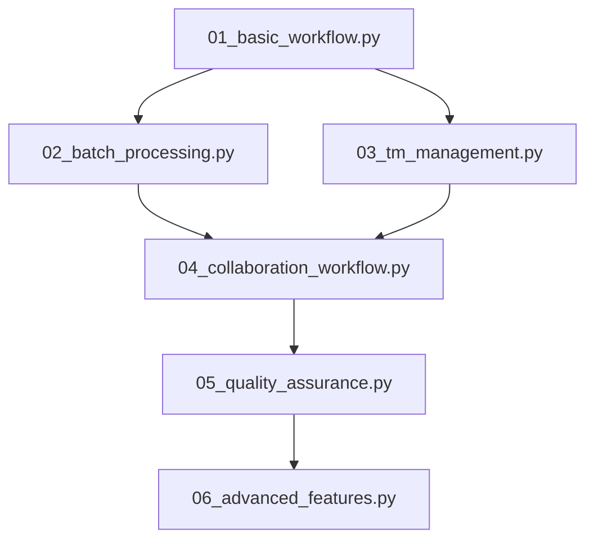

# Trans-Hub 示例集合

本目录包含了Trans-Hub翻译管理系统的完整示例集合，从基础功能到高级企业级特性的全面演示。

## 📋 示例概览

| 示例文件 | 功能描述 | 难度级别 | 适用场景 |
|---------|---------|---------|----------|
| `01_basic_workflow.py` | 基础翻译工作流 | 🟢 初级 | 快速入门、核心功能了解 |
| `02_batch_processing.py` | 批量翻译处理 | 🟡 中级 | 大规模内容处理 |
| `03_tm_management.py` | 翻译记忆库管理 | 🟡 中级 | 提高翻译一致性和效率 |
| `04_collaboration_workflow.py` | 协作翻译工作流 | 🟠 中高级 | 团队协作、项目管理 |
| `05_quality_assurance.py` | 翻译质量保证 | 🟠 中高级 | 企业级质量控制 |
| `06_advanced_features.py` | 高级功能演示 | 🔴 高级 | 企业级部署、系统集成 |

## 🚀 快速开始

### 环境准备

1. **确保依赖已安装**：
   ```bash
   cd packages/server
   poetry install
   ```

2. **数据库初始化**：
   ```bash
   poetry run alembic upgrade head
   ```

3. **运行示例**：
   ```bash
   # 从基础示例开始
   poetry run python examples/01_basic_workflow.py

   # 或运行任何其他示例
   poetry run python examples/02_batch_processing.py
   ```

### 推荐学习路径



## 📚 详细说明

### 1. 基础翻译工作流 (`01_basic_workflow.py`)

**学习目标**：
- 理解Trans-Hub的核心概念
- 掌握基本的翻译提交和处理流程
- 了解评论和反馈机制

**核心功能**：
- ✅ 提交翻译请求
- ✅ 模拟翻译处理
- ✅ 发布翻译结果
- ✅ 获取已发布翻译
- ✅ 添加和查看评论

**运行时间**：约30秒

### 2. 批量翻译处理 (`02_batch_processing.py`)

**学习目标**：
- 掌握大规模内容的批量处理
- 了解多语言并行翻译
- 学习批量操作的统计和报告

**核心功能**：
- ✅ 批量提交翻译请求
- ✅ 多语言并行处理
- ✅ 批量发布和查询
- ✅ 统计分析和报告

**运行时间**：约45秒

### 3. 翻译记忆库管理 (`03_tm_management.py`)

**学习目标**：
- 理解翻译记忆库的价值和应用
- 掌握TM的创建、管理和优化
- 学习模糊匹配和精确匹配机制

**核心功能**：
- ✅ TM创建和管理
- ✅ 翻译对添加和查询
- ✅ 模糊匹配和精确匹配
- ✅ TM复用和优化
- ✅ 质量评分和过滤

**运行时间**：约60秒

### 4. 协作翻译工作流 (`04_collaboration_workflow.py`)

**学习目标**：
- 了解大型翻译项目的团队协作模式
- 掌握任务分配和进度跟踪
- 学习审校和版本管理流程

**核心功能**：
- ✅ 项目和任务管理
- ✅ 译者分配和协作
- ✅ 审校和评论反馈
- ✅ 进度跟踪和报告
- ✅ 版本管理

**运行时间**：约90秒

### 5. 翻译质量保证 (`05_quality_assurance.py`)

**学习目标**：
- 掌握自动化质量检查机制
- 了解术语一致性验证
- 学习质量评分和改进系统

**核心功能**：
- ✅ 自动化质量检查
- ✅ 术语一致性验证
- ✅ 格式和样式检查
- ✅ 质量评分系统
- ✅ 质量报告和改进建议

**运行时间**：约75秒

### 6. 高级功能演示 (`06_advanced_features.py`)

**学习目标**：
- 了解企业级部署的高级特性
- 掌握系统集成和扩展能力
- 学习性能监控和运维管理

**核心功能**：
- ✅ 多项目管理和资源共享
- ✅ 高级工作流自动化
- ✅ 外部翻译服务集成
- ✅ 性能监控和分析
- ✅ 数据导入导出
- ✅ 自定义插件系统

**运行时间**：约120秒

## 🛠️ 技术架构

### 核心组件

```
┌─────────────────┐    ┌─────────────────┐    ┌─────────────────┐
│   Bootstrap     │    │   Coordinator   │    │   Services      │
│   (DI容器)      │───▶│   (门面模式)    │───▶│   (业务逻辑)    │
└─────────────────┘    └─────────────────┘    └─────────────────┘
         │                       │                       │
         ▼                       ▼                       ▼
┌─────────────────┐    ┌─────────────────┐    ┌─────────────────┐
│   Configuration │    │   Database      │    │   External APIs │
│   (Pydantic v2) │    │   (SQLAlchemy)  │    │   (集成服务)    │
└─────────────────┘    └─────────────────┘    └─────────────────┘
```

### 示例架构特点

- **🔧 依赖注入**：使用现代DI容器管理组件生命周期
- **📊 数据验证**：基于Pydantic v2的强类型数据模型
- **🗄️ 数据库管理**：SQLAlchemy + Alembic的现代数据库栈
- **🔄 异步处理**：全异步架构，支持高并发
- **🧪 测试友好**：每个示例使用独立的临时数据库

## 🎯 学习建议

### 初学者路径
1. **从基础开始**：先运行 `01_basic_workflow.py`，理解核心概念
2. **逐步深入**：按顺序学习每个示例，不要跳跃
3. **动手实践**：修改示例代码，观察不同参数的效果
4. **阅读源码**：查看 `_shared.py` 了解底层实现

### 进阶开发者路径
1. **架构理解**：重点关注DI容器和服务层设计
2. **扩展开发**：基于示例开发自定义功能
3. **性能优化**：分析批量处理和并发机制
4. **集成实践**：将示例集成到实际项目中

### 企业用户路径
1. **需求映射**：将示例功能映射到实际业务需求
2. **部署规划**：参考高级功能示例规划生产环境
3. **团队培训**：使用示例进行团队技术培训
4. **定制开发**：基于示例开发企业特定功能

## 📡 Redis Stream 事件消费

### 事件格式变更说明

从 v3.0.0 开始，`RedisStreamProducer` 使用 JSON 序列化来支持嵌套结构和非字符串类型的事件数据。

**旧格式（已废弃）：**
```python
# 每个字段都被强制转换为字符串
{
    "field1": "value1",
    "field2": "123",  # 数字被转换为字符串
    "field3": "{'nested': 'object'}"  # 嵌套对象被转换为字符串
}
```

**新格式：**
```python
# 整个事件数据被 JSON 序列化后存储在 payload 字段中
{
    "payload": '{"field1": "value1", "field2": 123, "field3": {"nested": "object"}}'
}
```

### 消费端示例

`redis_stream_consumer.py` 提供了完整的 Redis Stream 消费者示例，演示了：

- ✅ 如何创建消费者组
- ✅ 如何正确解析新的 JSON 序列化格式
- ✅ 如何处理解析错误和异常
- ✅ 如何确认消息已处理
- ✅ 完整的错误处理和日志记录

**运行消费者示例：**
```bash
# 确保 Redis 服务器正在运行
docker run -d -p 6379:6379 redis:7-alpine

# 运行消费者
poetry run python examples/redis_stream_consumer.py
```

### 迁移指南

如果你有现有的消费端代码需要迁移到新格式：

**旧代码：**
```python
# 直接访问字段
field_value = raw_data[b'field_name'].decode('utf-8')
```

**新代码：**
```python
import json

# 解析 JSON payload
payload_str = raw_data[b'payload'].decode('utf-8')
event_data = json.loads(payload_str)
field_value = event_data['field_name']
```

## 🔧 自定义和扩展

### 修改示例

所有示例都设计为易于修改和扩展：

```python
# 修改语言对
SOURCE_LANG = "en-US"
TARGET_LANGS = ["zh-CN", "ja-JP", "ko-KR"]  # 添加更多语言

# 修改内容类型
CONTENT_TYPES = ["ui", "marketing", "technical"]  # 自定义内容类型

# 修改质量阈值
QUALITY_THRESHOLD = 85  # 调整质量要求
```

### 添加新功能

```python
# 在任何示例中添加自定义逻辑
async def custom_processing_step(coordinator, content_id: str):
    """自定义处理步骤。"""
    # 你的自定义逻辑
    pass

# 集成到现有工作流
async with example_runner("custom.db") as coordinator:
    # 现有步骤...
    await custom_processing_step(coordinator, content_id)
    # 后续步骤...
```

## 🐛 故障排除

### 常见问题

**Q: 运行示例时出现导入错误**
```
ImportError: attempted relative import with no known parent package
```
**A**: 确保从项目根目录运行：
```bash
cd packages/server
poetry run python examples/01_basic_workflow.py
```

**Q: 数据库连接错误**
```
sqlalchemy.exc.OperationalError: (sqlite3.OperationalError) no such table
```
**A**: 运行数据库迁移：
```bash
poetry run alembic upgrade head
```

**Q: 依赖缺失错误**
```
ModuleNotFoundError: No module named 'xxx'
```
**A**: 重新安装依赖：
```bash
poetry install
```

### 调试技巧

1. **启用详细日志**：
   ```python
   import logging
   logging.basicConfig(level=logging.DEBUG)
   ```

2. **检查数据库状态**：
   ```bash
   # 查看迁移状态
   poetry run alembic current

   # 查看迁移历史
   poetry run alembic history
   ```

3. **使用调试器**：
   ```python
   import pdb; pdb.set_trace()  # 在关键位置添加断点
   ```

## 📖 相关资源

- **📚 API文档**：查看完整的API参考文档
- **🏗️ 架构指南**：了解系统设计原理和最佳实践
- **🚀 部署指南**：生产环境部署和运维指南
- **🤝 贡献指南**：参与项目开发和社区贡献
- **💬 社区讨论**：加入开发者社区交流

## 📝 许可证

本示例集合遵循与Trans-Hub主项目相同的许可证。

---

**🎉 祝您学习愉快！如有问题，欢迎提交Issue或参与社区讨论。**
